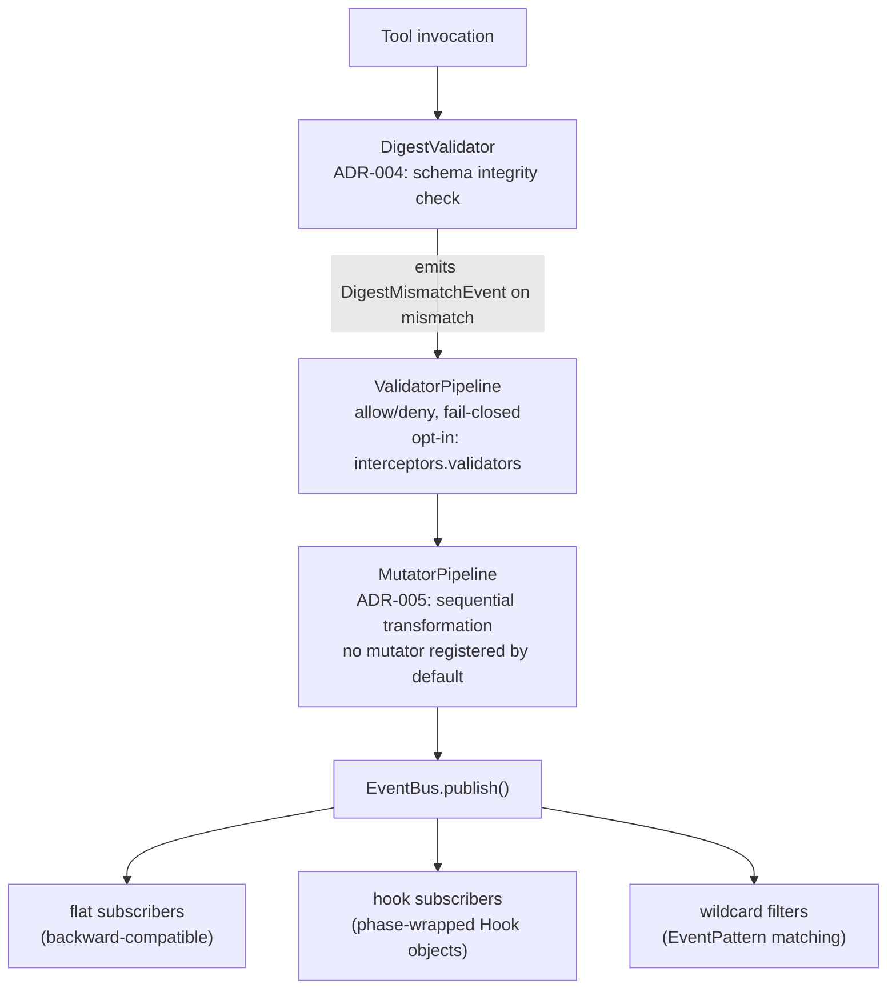

# Interceptor Framework

MCP Hangar implements the SEP-1763 interceptor framework with hook-based event delivery and priority-ordered mutator pipelines (experimental — disabled by default; validators/mutators register only when explicitly configured, so the pipeline is a no-op out of the box). See [ADR-005](../adr/ADR-005-sep-1763-interceptor-compliance.md) for design rationale.

## Architecture



## Components

### Digest Pinning (ADR-004)

| Type | Location | Purpose |
| ------ | ---------- | --------- |
| `ToolDigest` | `domain/value_objects/tool_digest.py` | SHA-256 fingerprint of a tool's canonical schema |
| `DigestPolicy` | `domain/value_objects/tool_digest.py` | Enforcement level + unknown-tool handling + allowlist |
| `DigestEnforcement` | `domain/value_objects/tool_digest.py` | Enum: `audit`, `warn`, `block` |
| `compute_tool_digest()` | `domain/services/digest_computation.py` | Deterministic SHA-256 over canonical JSON |
| `DigestValidator` | `domain/services/digest_validator.py` | Validates tools against policy, emits `DigestMismatchEvent` |

`compute_tool_digest()` uses RFC 8785 JSON Canonicalization Scheme (JCS) before
hashing. v1.3.0 treats `None`, `{}`, `[]`, and `""` as absent values to avoid
false drift between servers that alternate between missing and empty optional
fields. Tool entries with a missing, empty, or non-string `name` field are
rejected before digest computation.

### Hook-Based Event Model (ADR-005)

| Type | Location | Purpose |
| ------ | ---------- | --------- |
| `HookPhase` | `domain/value_objects/hook.py` | `StrEnum`: `PRE_VALIDATE` (`"pre_validate"`), `POST_VALIDATE` (`"post_validate"`), `PRE_MUTATE` (`"pre_mutate"`), `POST_MUTATE` (`"post_mutate"`), `OBSERVE` (`"observe"`), and the two wire phases `interceptor/invoke` delivers on, `REQUEST` (`"request"`) and `RESPONSE` (`"response"`) |
| `Hook` | `domain/value_objects/hook.py` | Wraps `(event, phase, sequence_number)` |
| `IHookSubscriber` | `domain/contracts/hook_subscriber.py` | Protocol for phase-aware event delivery |
| `EventBus` | `infrastructure/event_bus.py` | Fan-out to both flat subscribers and hook subscribers |

### Mutator Pipeline (ADR-005)

| Type | Location | Purpose |
| ------ | ---------- | --------- |
| `IMutator` | `domain/contracts/mutator.py` | Protocol: `priority_hint`, `applies_to`, `mutate()` |
| `MutationContext` | `domain/contracts/mutator.py` | Input: method, direction, payload, correlation_id |
| `MutationResult` | `domain/contracts/mutator.py` | Output: payload, changed flag, audit_only flag |
| `MutatorPipeline` | `application/services/mutator_pipeline.py` | Sorts by `(priority_hint, registration_index)`, executes sequentially |
| `ResponseTruncator` | `application/mutators/response_truncator.py` | Truncates oversized `tools/call` responses, emits `ResponseTruncated`. No configuration registers it: the truncation a `truncation:` section turns on is the batch budget in `infrastructure/truncation/`, not this mutator |

### Validator Pipeline

| Type | Location | Purpose |
| ------ | ---------- | --------- |
| `IValidator` | `domain/contracts/validator.py` | Protocol: `priority_hint`, `applies_to`, `fail_open`, `validate()` |
| `ValidatorPipeline` | `application/services/validator_pipeline.py` | Sorts by `(priority_hint, registration_index)`; the first enforced denial refuses the call. A validator that raises denies unless it declares `fail_open`; an `audit_only` denial is recorded, not enforced |
| `build_validator_pipeline()` | `application/services/interceptor_registry.py` | Builds the pipeline from the `interceptors.validators` config list |
| `PayloadSizeValidator` | `application/validators/payload_size.py` | The one built-in validator (`type: payload_size`): denies a `tools/call` whose JSON payload exceeds `max_bytes` (default 1000000) |

Validators are the only interceptors a configuration can register. With the
section absent the pipeline is empty and every call passes:

```yaml
interceptors:
  validators:
    - type: payload_size
      max_bytes: 1000000
```

A denied call is refused with `error_type` `ValidatorDenied` and logged as
`batch_call_refused` with `gate=validators` and `reason=validator_denied`. An
unknown `type` refuses the configuration.

### Wildcard Subscriptions (ADR-005)

| Type | Location | Purpose |
| ------ | ---------- | --------- |
| `EventPattern` | `domain/value_objects/event_pattern.py` | Segment-wise wildcard matching (`*`, `tools/*`, `*/response`) |
| `compile_event_patterns()` | `server/api/ws/filters.py` | Compiles raw strings into `EventPattern` objects |
| `matches_filters()` | `server/api/ws/filters.py` | Tests events against wildcard-aware subscription filters |

### Interceptor Discoverability

`GET /interceptors/list` returns mcp-hangar's capabilities as a SEP-1763 interceptor.
This is exposed as a plain HTTP endpoint (not a JSON-RPC method) because the MCP
Python SDK does not yet support custom JSON-RPC method registration for non-standard
methods. Once SDK support lands, this should migrate to a JSON-RPC `interceptors/list`
method per SEP-1763 (PR #2624).

The response below is the default shape, served to a client that has not
negotiated the extension:

```json
{
  "interceptors": [
    {
      "name": "io.mcp-hangar.validator",
      "version": "<package version>",
      "type": "validator",
      "supportedEvents": ["tools/call", "tools/list"],
      "modes": ["audit", "enforce"],
      "trustBoundary": "host"
    },
    {
      "name": "io.mcp-hangar.mutator",
      "version": "<package version>",
      "type": "mutator",
      "supportedEvents": ["tools/call"],
      "modes": ["enforce"],
      "trustBoundary": "host"
    }
  ]
}
```

A client that sends the header `MCP-Interceptor-Ext:
io.modelcontextprotocol/interceptors` (or `?ext=io.modelcontextprotocol/interceptors`
on the GET) gets the PR #2624 shape instead: `type` `validation` / `mutation`, a
`hooks` array of `{events, phase: "request"}`, `mode: "active"` and a
`description`. Only that client can reach `POST /interceptor/invoke`, which takes
a JSON-RPC envelope and answers `404` without the header:

```bash
curl -s -X POST http://localhost:8000/interceptor/invoke \
  -H 'MCP-Interceptor-Ext: io.modelcontextprotocol/interceptors' \
  -d '{"jsonrpc":"2.0","id":1,"method":"interceptor/invoke",
       "params":{"name":"mcp-hangar-validator","event":"tools/call","phase":"request"}}'
```

```json
{"jsonrpc":"2.0","id":1,"result":{"interceptor":"mcp-hangar-validator","type":"validation","phase":"request","durationMs":0.2,"valid":true}}
```

The invoke endpoint is a conformance-shaped no-op: the validator always answers
`valid: true` and the mutator returns the payload with `modified: false`. It
publishes an `InterceptorInvoked` hook on the event bus and enforces nothing.

The negotiated shape and `interceptor/invoke` still use the names
`mcp-hangar-validator` and `mcp-hangar-mutator`, not the `io.mcp-hangar.*` names
of the default shape
([mcp-hangar/mcp-hangar#1690](https://github.com/mcp-hangar/mcp-hangar/issues/1690)).
Invoking a name from the default listing is refused with `-32602 unknown
interceptor`.

## Mutator Ordering

Mutators execute in ascending `priority_hint` order. Ties are broken by registration order (stable sort).

| Mutator | priority_hint | Rationale |
| --------- | -------------- | ----------- |
| (future: PII redactor) | 100 | Runs early to redact before other transforms |
| (future: schema enforcer) | 500 | Validates structure after redaction |
| ResponseTruncator | 1000 | Runs last to truncate after all other transforms |

## Event Flow

1. `DigestValidator.validate_tool()` produces `DigestValidationResult` with optional `DigestMismatchEvent`.
2. Caller publishes events via `EventBus.publish()`.
3. EventBus delivers to flat subscribers (type-matched), hook subscribers (phase-wrapped), and wildcard-filtered WebSocket streams.
4. `MutatorPipeline.execute()` runs registered mutators sequentially.
5. Mutators collect domain events (e.g., `ResponseTruncated`) via `event_collector` list pattern.
6. Caller publishes mutator events to EventBus for audit trail.

## P2 Items (Not Yet Implemented)

- `interceptors/list` and `interceptor/invoke` as JSON-RPC methods on the MCP
  endpoint (they are plain HTTP routes today), and an invoke that runs the
  configured pipelines rather than a no-op
- Shadow mutations (`MutationResult.audit_only` exists but nothing consumes it;
  validators already support `audit_only` denials)
- Per-interceptor `failOpen` on mutators (validators already declare `fail_open`)
- Extended lifecycle events (`resources/*`, `prompts/*`, `sampling/*`, `elicitation/*`, `roots/*`)
