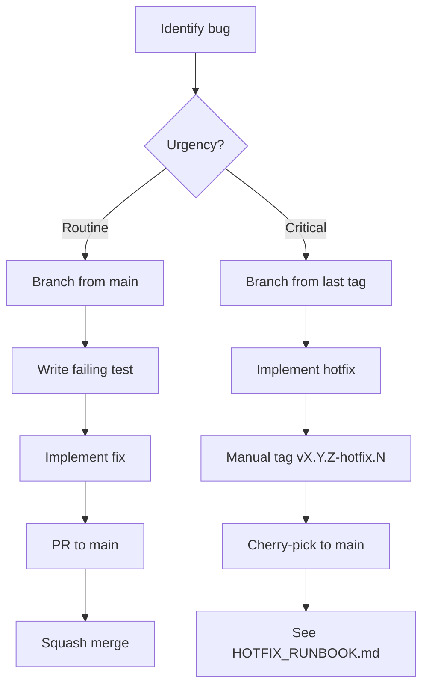
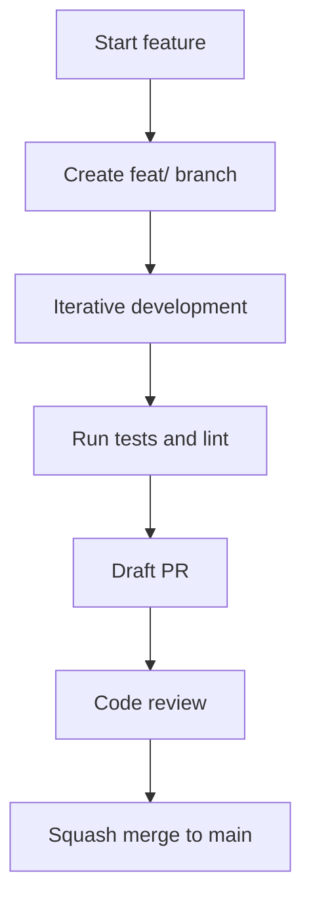
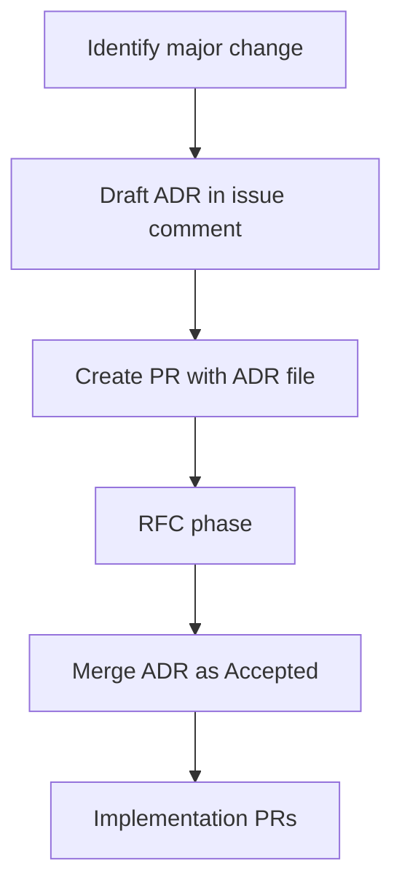

# Git Flow

## Purpose and scope

This document defines the branching, commit, and release strategies for the mcp-hangar project.
It covers routine development, bug fixes, feature implementation, and administrative flows.
Adherence ensures a clean, searchable history and reliable automation.

This document does not cover Architectural Decision Record (ADR) governance.
ADR governance rules reside in the core repo's [docs/internal/ADR_AGENTS.md](https://github.com/mcp-hangar/mcp-hangar/blob/main/docs/internal/ADR_AGENTS.md).
The ADRs themselves live in this repo under [adr/](../adr/README.md).
General repository conventions, such as language requirements and source layout, are in the root AGENTS.md.
External contributors should also consult CONTRIBUTING.md for environment setup.

Rules defined here are enforced by CI via required status checks (pr-title.yml,
branch-name.yml, changelog-check.yml, pr-body.yml, pr-validation.yml, security.yml).
Enforcement details are listed in Section 12.

## Decision log

The following table tracks the evolution of git and workflow standards.

| # | Original recommendation | Final decision | Reasoning |
|---|-------------------------|----------------|-----------|
| 1 | Merge strategy | squash-merge by default | - |
| 2 | Issue # in branch name | optional (not required) | - |
| 3 | Discussions categories | defer until sustained external traffic exists | Original proposed 4 categories. Final decision defers implementation to avoid maintaining empty forums while traffic is low. |
| 4 | Stale bot | 90-day stale, 30-day close (applied via stale.yml) | Tightened from 180/90 post-1.0 per PR #113. |
| 5 | CC scope list | 13 approved, 3 rejected, 1 deferred | Auth, events, and cqrs were collapsed into core or security to reduce noise. Proto deferred pending higher change frequency. |
| 6 | Release cadence | ad-hoc, release-please planned | - |
| 7 | Deprecation policy | post-1.0 SemVer: deprecate in minor, remove in next major | Project is at v1.5.0. Breaking changes require a major version bump. |
| 8 | Dependabot auto-merge | auto-merge dev, actions, and runtime CVE patches | Runtime CVE patches are included in auto-merge to maintain security posture with minimal manual intervention. |
| 9 | ADR authorship | agents may draft, maintainer authors PR | - |
| 10 | Pre-release flow location | documented in this file (section 9) | - |
| 11 | Hotfix forward-port automation | deferred, manual cherry-pick | - |

## Branch naming and merge strategy

The project uses a squash-merge strategy for all pull requests.
Rebase-merge and merge-commit are disabled at the repository level.
This preserves a linear history where every commit on main corresponds
to exactly one PR whose title was validated by `pr-title.yml`.
Branch names must follow a structured prefix pattern to support automation.

Standard prefixes:

- feat/<scope>-<slug> (new features)
- fix/<scope>-<slug> (bug fixes)
- perf/ (performance optimizations)
- refactor/ (code restructuring without behavior change)
- docs/ (documentation changes)
- test/ (test suite additions or modifications)
- build/ (build system or dependency changes)
- ci/ (continuous integration configuration)
- chore/ (routine maintenance)
- hotfix/<vX.Y.Z> (emergency fixes)

Tool-specific prefixes:

- dependabot/* (automated dependency updates)
- copilot/<task>-<slug> (AI assisted changes)
- release-please--* (automated release preparation)

Including issue numbers in branch names is optional but encouraged for complex fixes.

## Conventional Commits scope reference

Scopes provide context to the nature of a change.
They are used in commit messages: `<type>(<scope>): <subject>`.

Since the multi-repo split (ADR-009), scopes are enforced **per repo**, not
from one shared list. Each repo's `.github/workflows/pr-title.yml` sets
`requireScope: true` with its own accepted-scopes list -- that file is the
source of truth, not this table. The three verified lists below (checked
against each repo's `pr-title.yml`) illustrate the shape; other repos
(`mcp-hangar-operator`, `mcp-hangar-agent`, `mcp-hangar-website`,
`terraform-provider`) each define their own the same way.

### `mcp-hangar/mcp-hangar` (core)

| Scope | Description |
|-------|-------------|
| core | Logic in src/mcp_hangar/domain/ or application/ |
| enterprise | **Legacy.** Pre-MIT-relicense name for logic in src/mcp_hangar/auth, compliance, integrations, approvals, and infrastructure/persistence. The scope is still CI-accepted for compatibility; prefer `core` or `security` in new commits. |
| cli | Command line interface and Typer registration |
| ci | Continuous integration workflow changes |
| operator | Kubernetes operator components |
| helm | Helm chart templates and values |
| ui | Frontend or dashboard components. Currently vacant/reserved: no `ui` code exists in this repo, but the scope remains CI-accepted for future use. |
| observability | Metrics, tracing, and logging infrastructure |
| security | Authentication, authorization, and secret management |
| docs | Markdown documentation and MkDocs config |
| deps | Dependency updates and lockfile changes |
| release | Release artifacts and versioning |
| repo | Root-level governance files: AGENTS.md, CODEOWNERS, LICENSE |
| infra | Dockerfile, Makefile, and local dev setup |
| tests | Test fixtures and suite configuration |

Rejected scopes:

- auth (collapse into security)
- events (collapse into core)
- cqrs (collapse into core)

Deferred:

- proto (revisit when protobuf change frequency justifies)

### `mcp-hangar/helm-charts`

Accepted scopes: `agent`, `ci`, `deps`, `docs`, `hangar`, `infra`,
`operator`, `release`, `repo`. Note this repo uses `hangar` where the core
table above uses `helm` -- the two lists are independent, not aliases of
each other.

### `mcp-hangar/docs` (this repo)

Accepted scopes: `architecture`, `ci`, `deps`, `guides`, `infra`,
`reference`, `release`, `repo`.

## Flow 1: Bug fix

Routine bug fixes target the main branch.
Critical production issues follow the hotfix sub-flow.

Hotfix branches must branch from the specific version tag where the bug exists.
Manual tagging is required before cherry-picking the fix back to the main branch.
Detailed operational steps are located in [HOTFIX_RUNBOOK.md](HOTFIX_RUNBOOK.md).

## Flow 2: Feature

Features are developed in isolation and merged once they meet quality gates.

400 LOC is a rule of thumb / decomposition trigger, not a hard rule.
Some 600-LOC features are obvious; some 200-LOC features beg to be split.
Use judgment.

Feature flags are an option for multi-PR features.
They are not the default.
Flag infrastructure carries cost and should be used only when continuous integration requires it.

## Flow 3: Epic and ADR

Large architectural changes require a formal Decision Record before implementation.

### Pre-community Phase A fallback

Until the project has at least 5 active external contributors, Phase A may be conducted as a draft PR with `Status: Proposed` and label `rfc`, held open for a 5-14 day soak. GH Discussion is not required. If external comment arrives, incorporate. If not, proceed to merge after soak. Revisit this fallback when sustained Discussion traffic exists.

ADRs must be merged before implementation begins.
Once a status is set to `**Status:** Accepted` (per ADR-006 line 3), the ADR is immutable.
Changes require a new ADR that supersedes the old one with bidirectional references.
Agents may draft ADRs in issue comments but never author the PR.

### Decision Tree: Issue vs Discussion vs PR

| Question | Issue | Discussion | PR |
|----------|-------|------------|----|
| Is the decision known? | No | No | Yes |
| Do we need consensus? | Yes | Yes | No |
| Will this produce a mergeable artifact? | No | No | Yes |

## Deprecation policy

The project is at v1.5.0 and follows standard SemVer deprecation rules:

- Deprecations must be marked in at least one minor release.
- Removal occurs earliest in the next major release.
- ADR-008 will formalize additional deprecation workflow details.

## Pre-release flow

Pre-releases allow for testing artifacts in a controlled environment.
This is an operational workflow driven by tags.

Tagging `vX.Y.Z-rc.N` triggers .github/workflows/release.yml to publish to TestPyPI.
The project uses alpha, beta, and rc suffixes for lifecycle management.
Promoting a release to production is done by tagging `vX.Y.Z` (no -rc suffix).
This triggers the same workflow to publish the final artifact to PyPI.

Reference .github/workflows/release.yml for the specific logic of tag-driven publishing.

## Release cadence and process

Releases are currently ad-hoc based on feature readiness and security needs.
This follows the decision made in section 2, row 6.

release-please runs on every push to `main` and maintains a long-running
Release PR (`release-please--branches--main`) summarizing the next release.
Merging that PR creates the version tag, which `release.yml` consumes to
publish to PyPI and GHCR. There is no scheduled release cron -- the Release PR
sits open until a maintainer decides "enough has accumulated."

### Release topology (ADR-009)

The above describes the core repo only. Per [ADR-009](../adr/ADR-009-independent-release-topology.md),
core, operator, agent, and Helm charts each release independently on their
own SemVer line; there is no unified "MCP Hangar version." All published
images and charts are cosign-signed.

- **core** (`mcp-hangar/mcp-hangar`): release-please Release PR on `main`;
  merging it tags `vX.Y.Z`, consumed by `release.yml` to publish to PyPI and
  a signed Docker image on GHCR.
- **operator** (`mcp-hangar/mcp-hangar-operator`): pushing a `v*.*.*` tag
  publishes a signed image and an `install.yaml` manifest to GHCR.
- **agent** (`mcp-hangar/mcp-hangar-agent`): pushing a tag publishes a
  signed image to GHCR.
- **helm-charts** (`mcp-hangar/helm-charts`): push-to-main publishes the OCI
  charts to GHCR.

## Hotfix process

Hotfixes are emergency releases to address critical production regressions or CVEs.
They bypass the standard feature flow to provide rapid resolution.

A hotfix branch is cut directly from the target version tag.
After verification, the fix is tagged and then cherry-picked into the main branch.
Detailed manual steps are in [HOTFIX_RUNBOOK.md](HOTFIX_RUNBOOK.md).

## Automation surface

### Active today

This is the core repo's (`mcp-hangar/mcp-hangar`) full workflow set.
Per ADR-009, chart and operator CI live in their own repos -- `mcp-hangar/helm-charts`
and `mcp-hangar/mcp-hangar-operator` respectively -- not here.

PR gates:

- pr-title.yml (Conventional Commits title, scope required)
- pr-body.yml (required PR template sections)
- branch-name.yml (branch prefix validation)
- changelog-check.yml (changelog entry present)
- pr-validation.yml (change detection and the required-check aggregate)
- ci-core.yml (lint, domain and application tests, integration, build)
- ci-docs.yml (markdown linting via markdownlint-cli2)
- actionlint.yml (workflow file linting)
- security.yml (dependency-audit, codeql, container-scan, secrets-scan, semgrep, sbom)

Release:

- release.yml (TestPyPI and PyPI publishing)
- release-please.yml (automated version bump and Release PR)

Housekeeping:

- stale bot (stale.yml)
- Dependabot auto-merge (dependabot-automerge.yml)
- project-add.yml (adds new issues and PRs to the project board)
- live-verify.yml (black-box live verification; opt-in via workflow_dispatch and nightly, not on PRs)

### Retained but enforcing nothing

The former enterprise import boundary is **no longer enforced**.
Both `security.yml`'s `import-boundary` job and `pr-validation.yml`'s
`enterprise-boundary` job are no-op stubs whose only step echoes a message,
v1.3 having folded the enterprise package into `src/mcp_hangar/`.
Both jobs still run and still report green.
Do not rely on either to catch a boundary violation.

### Reviewer-only (not auto-enforced)

- Deprecation policy: violation caught by reviewer, not by CI.
