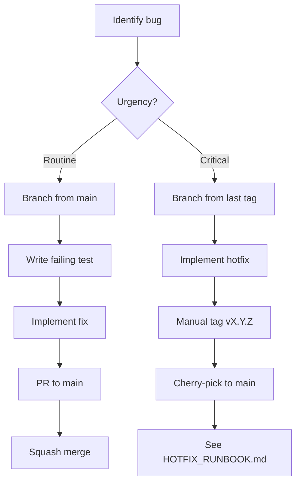
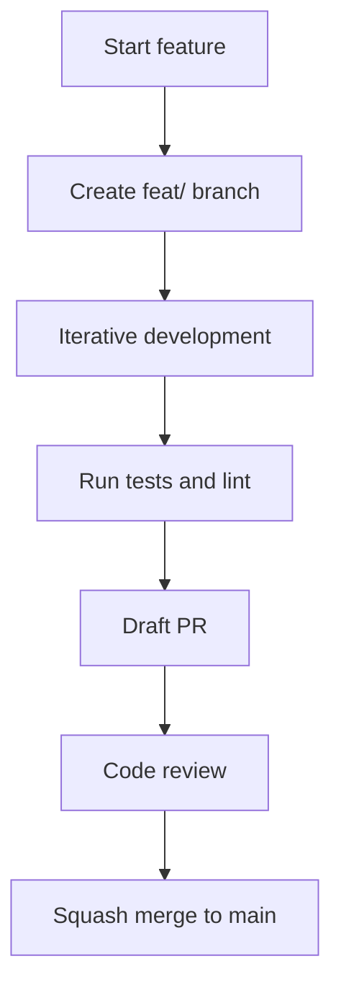
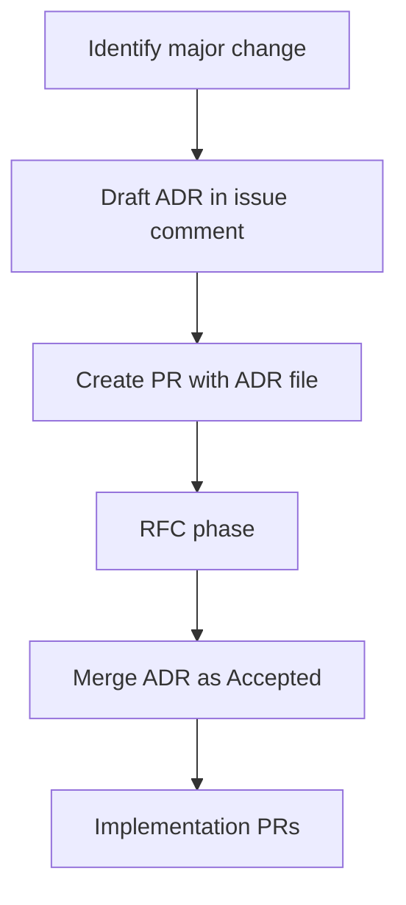

# Git Flow

## Purpose and scope

This document defines the branching, commit, and release strategies for the mcp-hangar project.
It covers routine development, bug fixes, feature implementation, and administrative flows.
Adherence ensures a clean, searchable history and reliable automation.

This document does not cover Architectural Decision Record (ADR) governance.
ADR governance rules reside in the core repo's [docs/internal/ADR_AGENTS.md](https://github.com/mcp-hangar/mcp-hangar/blob/main/docs/internal/ADR_AGENTS.md).
The ADRs themselves live in this repo under [adr/](../adr/README.md).
General repository conventions, such as language requirements and source layout, are in the root AGENTS.md.
External contributors should also consult CONTRIBUTING.md for environment setup.

Rules defined here are enforced by CI via required status checks (pr-title.yml,
branch-name.yml, changelog-check.yml, pr-body.yml, pr-validation.yml, ci-core.yml);
see [BRANCH_PROTECTION.md](BRANCH_PROTECTION.md) for the exact check names.
Enforcement details are listed under Automation surface.

## Decision log

The following table tracks the evolution of git and workflow standards.

| # | Original recommendation | Final decision | Reasoning |
| --- | ------------------------- | ---------------- | ----------- |
| 1 | Merge strategy | squash-merge by default | - |
| 2 | Issue # in branch name | optional (not required) | - |
| 3 | Discussions categories | defer until sustained external traffic exists | Original proposed 4 categories. Final decision defers implementation to avoid maintaining empty forums while traffic is low. |
| 4 | Stale bot | 90-day stale, 30-day close (applied via stale.yml) | Tightened from 180/90 post-1.0 per PR #113. |
| 5 | CC scope list | 13 approved, 3 rejected, 1 deferred | Auth, events, and cqrs were collapsed into core or security to reduce noise. Proto deferred pending higher change frequency. |
| 6 | Release cadence | ad-hoc, release-please planned | - |
| 7 | Deprecation policy | 2.x: a change that breaks callers ships as a minor with an upgrade note | A major is a maintainer decision, never computed from a commit; see Deprecation policy. |
| 8 | Dependabot auto-merge | auto-merge dev, actions, and runtime CVE patches | Runtime CVE patches are included in auto-merge to maintain security posture with minimal manual intervention. |
| 9 | ADR authorship | agents may draft, maintainer authors PR | - |
| 10 | Pre-release flow location | documented in this file (see Pre-release flow) | - |
| 11 | Hotfix forward-port automation | deferred, manual cherry-pick | - |

## Branch naming and merge strategy

The project uses a squash-merge strategy for all pull requests.
Rebase-merge is disabled at the repository level, and the required linear history
on `main` refuses a merge commit.
This preserves a linear history where every commit on main corresponds
to exactly one PR whose title was validated by `pr-title.yml`.
Branch names must follow a structured prefix pattern to support automation.

Standard prefixes:

- feat/<scope>-<slug> (new features)
- fix/<scope>-<slug> (bug fixes)
- perf/ (performance optimizations)
- refactor/ (code restructuring without behavior change)
- docs/ (documentation changes)
- test/ (test suite additions or modifications)
- build/ (build system or dependency changes)
- ci/ (continuous integration configuration)
- chore/ (routine maintenance)
- revert/ (reverting an earlier change)
- security/ (security fixes)
- hotfix/<vX.Y.Z> (emergency fixes)

Tool-specific prefixes:

- dependabot/* (automated dependency updates)
- copilot/<task>-<slug> (AI assisted changes)
- release-please--* (automated release preparation)

Including issue numbers in branch names is optional but encouraged for complex fixes.

## Conventional Commits scope reference

Scopes provide context to the nature of a change.
They are used in commit messages: `<type>(<scope>): <subject>`.

Since the multi-repo split (ADR-009), scopes are enforced **per repo**, not
from one shared list. Each repo's `.github/workflows/pr-title.yml` sets
`requireScope: true` with its own accepted-scopes list -- that file is the
source of truth, not this table. The three verified lists below (checked
against each repo's `pr-title.yml`) illustrate the shape; other repos
(`mcp-hangar-operator`, `mcp-hangar-website`) each
define their own the same way.

### `mcp-hangar/mcp-hangar` (core)

| Scope | Description |
| ------- | ------------- |
| core | Logic in src/mcp_hangar/domain/ or application/ |
| cli | Command line interface and Typer registration |
| ci | Continuous integration workflow changes |
| operator | Kubernetes operator components |
| helm | Helm chart templates and values |
| ui | Frontend or dashboard components. Currently vacant/reserved: no `ui` code exists in this repo, but the scope remains CI-accepted for future use. |
| observability | Metrics, tracing, and logging infrastructure |
| security | Authentication, authorization, and secret management |
| docs | Markdown documentation and MkDocs config |
| deps | Dependency updates and lockfile changes |
| deps-dev | Development-only dependency updates |
| release | Release artifacts and versioning |
| repo | Root-level governance files: AGENTS.md, CODEOWNERS, LICENSE |
| infra | Dockerfile, Makefile, and local dev setup |
| tests | Test fixtures and suite configuration |

Rejected scopes:

- auth (collapse into security)
- events (collapse into core)
- cqrs (collapse into core)

Deferred:

- proto (revisit when protobuf change frequency justifies)

`enterprise`, the pre-MIT-relicense name for the auth, compliance, integrations
and approvals code, is no longer accepted; use `core` or `security`.

### `mcp-hangar/helm-charts`

Accepted scopes: `ci`, `deps`, `docs`, `hangar`, `infra`,
`operator`, `release`, `repo`. Note this repo uses `hangar` where the core
table above uses `helm` -- the two lists are independent, not aliases of
each other.

### `mcp-hangar/docs` (this repo)

Accepted scopes: `architecture`, `ci`, `deps`, `guides`, `infra`,
`reference`, `release`, `repo`.

## Flow 1: Bug fix

Routine bug fixes target the main branch.
Critical production issues follow the hotfix sub-flow.


```mermaid
flowchart TD
    A[Identify bug] --> B{Urgency?}
    B -- Routine --> C[Branch from main]
    C --> D[Write failing test]
    D --> E[Implement fix]
    E --> F[PR to main]
    F --> G[Squash merge]
    B -- Critical --> H[Branch from last tag]
    H --> I[Implement hotfix]
    I --> J[Manual tag vX.Y.Z]
    J --> K[Cherry-pick to main]
     K --> L[See HOTFIX_RUNBOOK.md]
```

Hotfix branches must branch from the specific version tag where the bug exists.
Manual tagging is required before cherry-picking the fix back to the main branch.
Detailed operational steps are located in [HOTFIX_RUNBOOK.md](HOTFIX_RUNBOOK.md).

## Flow 2: Feature

Features are developed in isolation and merged once they meet quality gates.


```mermaid
flowchart TD
    A[Start feature] --> B[Create feat/ branch]
    B --> C[Iterative development]
    C --> D[Run tests and lint]
    D --> E[Draft PR]
    E --> F[Code review]
    F --> G[Squash merge to main]
```

400 LOC is a rule of thumb / decomposition trigger, not a hard rule.
Some 600-LOC features are obvious; some 200-LOC features beg to be split.
Use judgment.

Feature flags are an option for multi-PR features.
They are not the default.
Flag infrastructure carries cost and should be used only when continuous integration requires it.

## Flow 3: Epic and ADR

Large architectural changes require a formal Decision Record before implementation.


```mermaid
flowchart TD
    A[Identify major change] --> B[Draft ADR in issue comment]
    B --> C[Create PR with ADR file]
    C --> D[RFC phase]
    D --> E[Merge ADR as Accepted]
    E --> F[Implementation PRs]
```

### Pre-community Phase A fallback

Until the project has at least 5 active external contributors, Phase A may be conducted as a draft PR with `Status: Proposed` and label `rfc`, held open for a 5-14 day soak. GH Discussion is not required. If external comment arrives, incorporate. If not, proceed to merge after soak. Revisit this fallback when sustained Discussion traffic exists.

ADRs must be merged before implementation begins.
Once a status is set to `**Status:** Accepted` (line 3 of the ADR), the ADR is immutable.
Changes require a new ADR that supersedes the old one with bidirectional references.
Agents may draft ADRs in issue comments but never author the PR.

### Decision Tree: Issue vs Discussion vs PR

| Question | Issue | Discussion | PR |
| ---------- | ------- | ------------ | ---- |
| Is the decision known? | No | No | Yes |
| Do we need consensus? | Yes | Yes | No |
| Will this produce a mergeable artifact? | No | No | Yes |

<a id="deprecation-policy"></a>

## Deprecation policy

The 2.x line does not compute a major version from commits. A change that
breaks callers ships as a **minor**, with an upgrade note in the core repo's
`upgrade.d/` naming the old and the new form; 2.2.0, 2.3.0 and 2.24.0 shipped
that way. A commit never uses `!` or a `BREAKING CHANGE:` footer, which would
make release-please compute a major. A major is a maintainer decision.

- Mark a deprecation in at least one minor release before removing it where
  the change allows.
- Every removal or behaviour change a reader must act on gets its upgrade note.

## Pre-release flow

Pre-releases allow for testing artifacts in a controlled environment.
This is an operational workflow driven by tags.

Tagging `vX.Y.Z-rc.N` triggers .github/workflows/release.yml to publish to
production PyPI — not TestPyPI, which was dropped because its trusted publisher
was never configured. `pip` ignores a pre-release unless asked with `--pre` or
an exact pin, so this is safe; the build carries no `latest` Docker tag and is
marked as a prerelease on GitHub (ADR-009).
The project uses alpha, beta, and rc suffixes for lifecycle management.
Promoting a release to production is done by tagging `vX.Y.Z` (no -rc suffix).
This triggers the same workflow to publish the final artifact to PyPI.

Reference .github/workflows/release.yml for the specific logic of tag-driven publishing.

## Changelog fragments

Changelog entries are written **one file per PR**, not as a line in a shared
block. Every non-trivial PR in the core repo adds exactly one file:

```text
changelog.d/<id>-<slug>.<kind>.md
```

`<kind>` is one of the six Keep a Changelog sections: `added`, `changed`,
`deprecated`, `removed`, `fixed`, `security`. The file holds the entry text
only -- no bullet, no heading, no PR link; `scripts/build_changelog.py` adds
all three at release time and deletes the fragment. `<id>` is a sort key and a
fallback: the PR link is normally read from the squash commit that added the
file, so a fragment written before the PR number exists still links correctly.

**Nobody edits `CHANGELOG.md` directly.** An entry written there is overwritten
by the next assembly.

This replaced a shared `## [Unreleased]` block, for two reasons that were both
mechanical rather than editorial. Every open PR wrote to the same anchor in the
same file, so two PRs open at once conflicted by construction and the second to
merge got a hand-resolve. And release-please generated its own section from the
commit subjects and inserted it *above* that block, so the hand-written prose
was orphaned under the wrong heading -- v2.3.0 shipped after consolidating three
separate `## [Unreleased]` blocks by hand. release-please now runs with
`skip-changelog: true` and owns the version, the tag and the release PR; the
fragments own the prose.

Enforced by `changelog-check.yml`, which requires an added fragment on any PR
touching `src/` or `pyproject.toml`, renders it to catch a
malformed one at PR time, and is bypassed by the `skip-changelog` label. A PR
whose title is `ci`, `test`, `style` or `docs`, or a `deps`/`deps-dev`
`chore`/`ci`/`build` bump, needs no fragment.
See `changelog.d/README.md` in the core repo.

## Release cadence and process

Releases are currently ad-hoc based on feature readiness and security needs.
This follows decision-log row 6.

release-please runs on every push to `main` and maintains a long-running
Release PR (`release-please--branches--main`) summarizing the next release.
Merging that PR creates the version tag, which `release.yml` consumes to
publish to PyPI and GHCR. There is no scheduled release cron -- the Release PR
sits open until a maintainer decides "enough has accumulated."

The changelog is assembled onto that Release PR, not on `main`: the last step of
`release-please.yml` checks out the release branch, folds `changelog.d/` into a
`## [X.Y.Z]` section and commits it there. Merging the Release PR therefore
lands the version bump and the notes in one squash commit, as it always did.
The step is idempotent -- release-please force-pushes its branch whenever a new
commit reaches `main`, which drops that commit and restores the fragments, and
the next run redoes the assembly.

### Release topology (ADR-009)

The above describes the core repo only. Per [ADR-009](../adr/ADR-009-independent-release-topology.md),
core, operator, and Helm charts each release independently on their
own SemVer line; there is no unified "MCP Hangar version." All published
images and charts are cosign-signed.

- **core** (`mcp-hangar/mcp-hangar`): release-please Release PR on `main`;
  merging it tags `vX.Y.Z`, consumed by `release.yml` to publish to PyPI and
  a signed Docker image on GHCR.
- **operator** (`mcp-hangar/mcp-hangar-operator`): pushing a `v*.*.*` tag
  publishes a signed image to GHCR and attaches the rendered `install.yaml` to
  the GitHub Release.
- **helm-charts** (`mcp-hangar/helm-charts`): a push to `main` that touches a
  chart publishes the OCI charts to GHCR.

## Hotfix process

Hotfixes are emergency releases to address critical production regressions or CVEs.
They bypass the standard feature flow to provide rapid resolution.

A hotfix branch is cut directly from the target version tag.
After verification, the fix is tagged and then cherry-picked into the main branch.
Detailed manual steps are in [HOTFIX_RUNBOOK.md](HOTFIX_RUNBOOK.md).

## Automation surface

### Active today

These are the core repo's (`mcp-hangar/mcp-hangar`) main workflows.
Per ADR-009, chart and operator CI live in their own repos -- `mcp-hangar/helm-charts`
and `mcp-hangar/mcp-hangar-operator` respectively -- not here.

PR gates:

- pr-title.yml (Conventional Commits title, scope required)
- pr-body.yml (required PR template sections)
- branch-name.yml (branch prefix validation)
- changelog-check.yml (changelog fragment present in changelog.d/)
- pr-validation.yml (change detection and the required-check aggregate)
- ci-core.yml (lint, domain and application tests, integration, build)
- ci-docs.yml (markdown linting via markdownlint-cli2)
- actionlint.yml (workflow file linting)
- domain-lint.yml (rejects non-canonical `mcp-hangar.io` hosts in URLs, ADR-011)
- security.yml (dependency-audit, codeql, container-scan, secrets-scan, semgrep, sbom)

Release:

- release.yml (PyPI publishing, releases and pre-releases alike)
- release-please.yml (automated version bump and Release PR)
- image-main.yml (image built from `main`)

Housekeeping:

- stale bot (stale.yml)
- Dependabot auto-merge (dependabot-automerge.yml)
- project-board.yml (adds new issues and PRs to the project board and moves their status)
- labels-sync.yml (applies `.github/labels.yml`)
- live-verify.yml (black-box live verification; opt-in via workflow_dispatch and nightly, not on PRs)
- other checks, none of them required: conformance.yml, fuzz.yml, cfl-pr.yml and
  cfl-batch.yml, deps-floor-audit.yml, examples-compose.yml, task-relay-smoke.yml,
  interceptor-pin-drift.yml (scheduled), scorecard.yml

### Retained but enforcing nothing

The former enterprise import boundary is **no longer enforced**.
`security.yml`'s `import-boundary` job is a no-op stub whose only step echoes a
message, v1.3 having folded the enterprise package into `src/mcp_hangar/`. It
still runs and still reports green; do not rely on it to catch a boundary
violation. Import rules that are enforced live in `.importlinter`, checked by
the `lint` job.

### Reviewer-only (not auto-enforced)

- Deprecation policy: violation caught by reviewer, not by CI.
