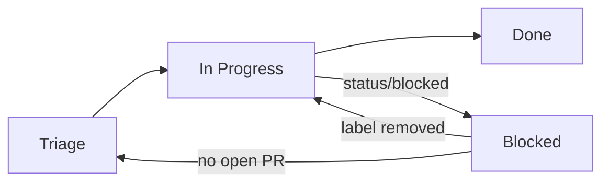

# Project Board

## Overview

The MCP Hangar project uses a GitHub Projects v2 board for issue triage and lifecycle tracking.

Board URL: `https://github.com/orgs/mcp-hangar/projects/<N>` (set after first run of setup script).

## Custom fields

| Field | Type | Values |
| --- | --- | --- |
| Priority | Single select | p0-critical, p1-high, p2-normal, p3-low |
| Scope | Single select | core, enterprise, cli, operator, helm, ui, observability, security, docs, deps, release, infra, tests, repo |
| Target Release | Text | Freeform, e.g. `1.1.0` |
| Estimate (LOC) | Number | Rough size hint |

## Status flow



Each transition, and what performs it:

| Status | Written by | On |
| --- | --- | --- |
| Triage | built-in **Item added to project** | anything reaching the board |
| In Progress | `project-board` reusable | a pull request declaring `Closes #N` |
| Blocked | `project-board` reusable | the `status/blocked` label being added |
| Blocked → out | `project-board` reusable | the label being removed: `In Progress` if an open pull request references the issue, otherwise `Triage` |
| Done | built-in **Item closed** and **Pull request merged** | the item closing or the pull request merging |

Triage and Done stay on the built-in workflows deliberately. They are reliable and free, and reimplementing them in a workflow would add a way for a missed webhook to strand an item in the wrong status permanently.

### Options with no mechanism

`Backlog`, `Ready` and `In Review` exist on the field and nothing writes them. Either drive them or delete them; an option nobody sets is a column that lies about the state of the work.

**Delete status options in the Projects UI only.** The `updateProjectV2Field` mutation takes the complete option list with no ids and rebuilds the field, so every option gets a new id and **every item loses its status** — including the options that were not being changed. This was measured on a scratch project on 2026-09-09: an item assigned to an option that stayed in the list came back with no value at all.

## Workflows

One reusable, `project-board.yml` in `mcp-hangar/.github`, does all of it. Each repository has a thin caller of the same name pinned to a commit of that repository.

| Event | Effect |
| --- | --- |
| `issues` opened / reopened | the issue goes on the board |
| `pull_request_target` opened / reopened / ready_for_review | the pull request goes on the board, and every issue it declares it closes moves to `In Progress` |
| `issues` labeled / unlabeled with `status/blocked` | `Blocked`, and back out again |

Every write is non-fatal. A board that cannot be reached must not fail a pull request — on 2026-09-09 an API rate limit red-checked five pull requests at once, which is worse than a stale board.

The cost of that choice is silence, so `project-board-health.yml` buys the visibility back: weekly, it proves the whole chain and opens an issue when it breaks. It proves it with a **write**, not a read — reading the project succeeded all morning on 2026-09-09 while the installation was missing `Organization > Projects`, and only a mutation caught it. The write rewrites one item's status to the value it already holds.

## Token setup

Board writes authenticate as the `mcp-hangar-release-bot` GitHub App, with a token **minted per run**. Nothing stores a project token.

1. In the App's settings, grant `Organization > Projects: Read & write`.
2. Approve the new permission **on the installation**. This is a separate prompt to the org owner, and it is easy to miss: until it is accepted, `GET /apps/{slug}` reports the permission while `GET /orgs/{org}/installations` does not, every read succeeds, and every write fails with `Could not resolve to a ProjectV2 with the number N`.
3. Store the App's private key as the `RELEASE_BOT_PRIVATE_KEY` organization secret. The client id is not a secret — GitHub returns it from the unauthenticated `/apps/{slug}` endpoint — so it is an input on the reusable with a default.

Verify the installation, not just the App:

```bash
gh api orgs/mcp-hangar/installations \
  --jq '.installations[] | select(.app_slug=="mcp-hangar-release-bot") | .permissions'
```

### Do not store an installation token

An earlier version of this page said to generate an installation token and store it as a `PROJECT_AUTOMATION_TOKEN` secret. That cannot work: an installation token expires after one hour, so the secret is dead by the next morning. Mint the token in the job that uses it.

It also has to be minted in that job specifically. `actions/create-github-app-token` revokes the token in its own `post` step, so one job cannot mint it and hand it to another, and a job output would not carry the value in any case because it is masked.

### Do not use `gh project`

Use the GraphQL mutations directly. Before `gh project` does anything it resolves whether the owner is a user or an organization, which needs `read:org` on the token; without that scope it fails with `unknown owner type` and adds nothing, while every other call keeps working.

### Static tokens

`PROJECT_AUTOMATION_TOKEN` was five repository-level copies of one credential created on 11 May 2026. Nobody could rotate or reproduce them, and the `mcp-hangar-website` copy was empty — silently, because the workflows that read it are non-fatal by design. That is why the App path replaced it.

## Setup script

```bash
bash scripts/setup-gh-project.sh
OWNER=mcp-hangar PROJECT_TITLE="MCP Hangar" bash scripts/setup-gh-project.sh
```

The script is idempotent. Re-runs are no-ops for existing fields. Status field options must be configured manually in the Project UI (the gh CLI does not support modifying built-in field options).

After the first run, set the `PROJECT_NUMBER` repository variable:

```bash
gh variable set PROJECT_NUMBER --body "<N>"
```
