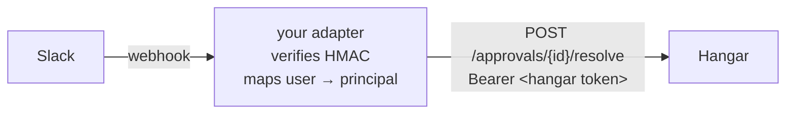

# Approval delivery adapters

> **New to this?** [Mid-flight consent for async tools](https://mcp-hangar.io/learn/mid-flight-consent) is the concept behind this page.

Hangar's approval gate holds a `tools/call` until a human decides. **Where that decision is asked for, and how the answer comes back, is not core's business.**

Core ships two channels — `event_stream` and `noop` — and resolves everything else from the `mcp_hangar.approvals.delivery` entry-point group. A vendor integration is a package you install, not a branch in the gateway. The reasoning is in [ADR-016](../adr/ADR-016-approval-resolution-chokepoint.md).

> **The gate only started holding calls in 2.1.0.** Everything on this page describes delivery, which is downstream of a gate that until then was not reachable on any shipped build: no config key put a tool behind it, the service was never constructed, and the REST routes answered `500` ([#678](https://github.com/mcp-hangar/mcp-hangar/issues/678)). If you wrote an adapter against an earlier release and never saw it fire, that is why — there was nothing to deliver. Put a tool behind the gate with [`approval_list`](../reference/configuration.md#holding-a-tool-for-a-human-approval_list) first.

## Putting a tool behind the gate

Delivery is only reached once a policy gates a tool. That is a `tools:` block:

```yaml
mcp_servers:
  payments:
    mode: remote
    endpoint: https://payments.example.com/mcp
    tools:
      approval_list:
        - "refund_*"
      approval_timeout_seconds: 600
      approval_channel: slack       # this policy's approvals go to Slack
```

`approval_channel` selects the adapter for approvals this policy holds. Leave it
unset and they go to the deployment's `approvals.channel`; name one and they go
there instead, so two servers can notify two different places.

A channel nothing claims degrades to `noop` with a warning — approvals still
queue and stay resolvable over REST, but nobody is notified. The gateway does
not refuse to boot over it by default; the startup check reports it at `ERROR`
instead, naming the scope and the channel:

```text
subsystem_configured_but_unreachable
  subsystem=approval_delivery
  required_by="tools.approval_list on mcp_server:payments (channel 'slack')"
```

That default is deliberate: the gate is fail-closed by timeout, so what is
missing is a signal rather than enforcement, and refusing the boot over a
notification channel turns a degraded notify path into an outage. A deployment
that would rather not start at all sets `approvals: {delivery: {required:
true}}`.

> **This changed in 2.7.0.** `approval_channel` used to be a label: it was
> recorded on the approval and merged across scopes, and one global delivery
> handled every approval whichever policy raised it. If your config sets
> different channels per server, they were all going to one place and now go
> where they say.

Full key reference: [Configuration → `tools` dual format](../reference/configuration.md#tools-dual-format).

> **Migrating from `approvals.channel: slack`?** Core carried a built-in Slack channel through 1.x. It was removed in 2.0. Nothing breaks silently: the channel now logs `approval_delivery_channel_unknown` and degrades to `noop`, so approvals queue undelivered but stay resolvable over the REST API. Restore delivery by installing an adapter — the full reference implementation is below.

## The built-in channel, and what it does not do

`event_stream` is what a deployment gets when it configures nothing. It writes a
log line and returns — no push of its own — because the notification has already
left by the time it runs. `ApprovalGateService` publishes a
`ToolApprovalRequested` domain event before it calls `send` and before it starts
waiting, and `/api/ws/events` streams every domain event to any client holding
`audit:read`:

```json
{
  "event_type": "ToolApprovalRequested",
  "approval_id": "0f2c…",
  "mcp_server_id": "payments",
  "tool_name": "refund_payment",
  "channel": "event_stream",
  "expires_at": "2026-08-12T09:15:00Z"
}
```

So a UI that holds a socket open sees held calls in real time and resolves them
over REST, with no adapter installed. What `event_stream` does not do is reach
anywhere a socket cannot: a room, a phone, a queue. That is what an adapter is
for.

> **This channel used to be called `dashboard`**, after a management UI that
> shipped with the Hangar Cloud tier and was archived with it. Nothing renders
> that UI, and the channel never pushed to it — its `send` wrote a log line
> while its docstring claimed a WebSocket integration that was never wired.
> `channel: dashboard` still resolves, to the same delivery, and logs
> `approval_delivery_channel_renamed` once at boot.

## The two halves

An adapter has an outbound half and an inbound half, and the inbound half is the one that used to live in core.

**Outbound** — notify the approver. Implement `send`; that is the whole protocol.

**Inbound** — take the answer back. Your adapter terminates the vendor's webhook **itself**: it verifies the vendor's signature, maps the vendor identity onto a Hangar principal, and then calls Hangar's ordinary API with an ordinary token.

That inbound shape is the point of the design. Core's `resolve` endpoint used to branch on an `X-Slack-Signature` header and dispatch to a vendor verifier, which meant an unauthenticated caller chose which authentication mechanism ran. Now there is one authentication path and one authorized chokepoint; your adapter is just another authenticated client of it.



## Registering a channel

```toml
# pyproject.toml of your adapter package
[project.entry-points."mcp_hangar.approvals.delivery"]
slack = "my_hangar_slack:build_delivery"
```

The entry point resolves to a callable taking the channel's config block and returning anything satisfying the `ApprovalDelivery` protocol:

```python
def build_delivery(config: dict):
    return SlackApprovalDelivery(
        webhook_url=config["webhook_url"],
        signing_secret=config["signing_secret"],
    )
```

Then in Hangar's config:

```yaml
approvals:
  channel: slack          # matches the entry-point name
  slack:                  # passed to your factory as `config`
    webhook_url: ${SLACK_WEBHOOK_URL}
    signing_secret: ${SLACK_SIGNING_SECRET}
```

An adapter that fails to load, or to construct, degrades to `noop` with a warning rather than stopping the gateway — a missing notification channel should not be an outage.

## Reference implementation: Slack

This is the code that used to ship in core, unchanged apart from the entry point, plus the inbound half.

### Outbound

```python
"""Slack approval delivery via incoming webhook."""

from typing import Any

from mcp_hangar.approvals.models import ApprovalRequest
from mcp_hangar.logging_config import get_logger

logger = get_logger(__name__)

MAX_ARG_DISPLAY = 500


def _sanitize_for_display(arguments: dict[str, Any]) -> str:
    """Render arguments for a human, truncated.

    Note what this does NOT do: redact. Hangar redacts secrets on the audit
    path, not here. If your channel is a shared room, treat the notification as
    readable by everyone in it and consider sending only the tool name.
    """
    import json

    text = json.dumps(arguments, indent=2, default=str)
    if len(text) > MAX_ARG_DISPLAY:
        text = text[:MAX_ARG_DISPLAY] + "\n… (truncated)"
    return text


def _build_slack_blocks(request: ApprovalRequest) -> list[dict[str, Any]]:
    """Block Kit payload with approve/deny buttons.

    `action_id` carries the approval id back to your webhook handler.
    """
    return [
        {
            "type": "section",
            "text": {
                "type": "mrkdwn",
                "text": (
                    f"*Approval required*\n"
                    f"*Tool:* `{request.tool_name}`\n"
                    f"*Server:* `{request.provider_id}`\n"
                    f"*Requested:* {request.requested_at.isoformat()}"
                ),
            },
        },
        {
            "type": "section",
            "text": {"type": "mrkdwn", "text": f"```{_sanitize_for_display(request.arguments)}```"},
        },
        {
            "type": "actions",
            "elements": [
                {
                    "type": "button",
                    "text": {"type": "plain_text", "text": "Approve"},
                    "style": "primary",
                    "action_id": f"approve:{request.approval_id}",
                },
                {
                    "type": "button",
                    "text": {"type": "plain_text", "text": "Deny"},
                    "style": "danger",
                    "action_id": f"deny:{request.approval_id}",
                },
            ],
        },
    ]


class SlackApprovalDelivery:
    """Sends approval notifications to Slack via incoming webhook."""

    def __init__(self, webhook_url: str, signing_secret: str) -> None:
        self._webhook_url = webhook_url
        self._signing_secret = signing_secret

    async def send(self, request: ApprovalRequest) -> None:
        """Notify. Logs and swallows errors -- delivery failure must not fail the call."""
        import httpx

        try:
            async with httpx.AsyncClient(timeout=10.0) as client:
                response = await client.post(
                    self._webhook_url,
                    json={"blocks": _build_slack_blocks(request)},
                )
                if response.status_code != 200:
                    logger.warning(
                        "slack_delivery_non_200",
                        approval_id=request.approval_id,
                        status=response.status_code,
                        body=response.text[:200],
                    )
                else:
                    logger.info(
                        "slack_approval_delivered",
                        approval_id=request.approval_id,
                        tool=request.tool_name,
                    )
        except Exception:  # noqa: BLE001
            logger.warning("slack_delivery_failed", approval_id=request.approval_id, exc_info=True)
```

### Inbound

Your own HTTP endpoint, in your own process. This half used to be `_handle_slack_callback` inside Hangar's routes.

```python
import hashlib
import hmac
import json
import time
from urllib.parse import parse_qs

import httpx

FRESHNESS_WINDOW_S = 300


def verify_slack_signature(signing_secret: str, headers, body: str) -> bool:
    """HMAC-SHA256 over `v0:{timestamp}:{body}`, with replay protection.

    The freshness window matters as much as the signature: without it a captured
    request stays valid forever. Compare in constant time.
    """
    timestamp = headers.get("x-slack-request-timestamp", "")
    signature = headers.get("x-slack-signature", "")
    if not timestamp or not signature:
        return False

    try:
        if abs(time.time() - int(timestamp)) > FRESHNESS_WINDOW_S:
            return False
    except ValueError:
        return False

    expected = (
        "v0="
        + hmac.new(
            signing_secret.encode(),
            f"v0:{timestamp}:{body}".encode(),
            hashlib.sha256,
        ).hexdigest()
    )
    return hmac.compare_digest(expected, signature)


async def handle_slack_callback(
    signing_secret: str,
    base_url: str,          # your deployment's Hangar URL -- you supply this
    headers,
    raw_body: str,
) -> None:
    if not verify_slack_signature(signing_secret, headers, raw_body):
        raise PermissionError("bad Slack signature")

    payload = json.loads(parse_qs(raw_body)["payload"][0])
    action_id = payload["actions"][0]["action_id"]        # "approve:<id>" | "deny:<id>"
    decision, approval_id = action_id.split(":", 1)
    slack_user = payload["user"]["id"]

    # The load-bearing line. Hangar's audit trail should name a Hangar
    # principal, not a vendor handle -- map it here, and refuse if you cannot.
    token = mint_hangar_token_for(slack_user)

    async with httpx.AsyncClient(timeout=10.0) as client:
        response = await client.post(
            f"{base_url}/api/approvals/{approval_id}/resolve",
            json={"decision": decision, "reason": f"via Slack by {slack_user}"},
            headers={"Authorization": f"Bearer {token}"},
        )
        response.raise_for_status()
```

`mint_hangar_token_for` is yours to implement, and it is where the security of this integration actually lives. It must establish that this Slack user corresponds to a Hangar principal holding `approval:resolve` — an OIDC exchange, a mapping table, whatever your identity story is. **Do not mint a single shared service token for every approver**: the audit trail would then record one identity for every decision, which is exactly the attribution problem this design removes.

## Testing an adapter

Test the signature verification against known-good and tampered payloads, including a stale timestamp — that is the part core no longer checks for you.

Hangar's own test for the registry ([`test_delivery_registry.py`](https://github.com/mcp-hangar/mcp-hangar/blob/mcp2/tests/unit/components/approvals/test_delivery_registry.py)) shows how a channel is resolved and what happens when one fails to load; it is a useful template for asserting that your entry point is discovered.

## See also

- [ADR-016](../adr/ADR-016-approval-resolution-chokepoint.md) — why core has one authorization chokepoint and no vendors
- [Authentication & Authorization](AUTHENTICATION.md) — minting tokens and the `approval:resolve` permission
- [REST API](REST_API.md) — the `/approvals` endpoints
- [Configuration](../reference/configuration.md#holding-a-tool-for-a-human-approval_list) — `approval_list`, `approval_timeout_seconds`, `approval_channel`
- [What a verdict establishes](../security/VERDICT_LIMITS.md) — what an `approved` record proves, and what it does not
