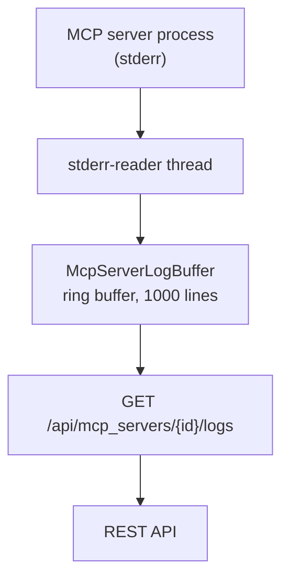

# Log Streaming

MCP Hangar captures stderr output from subprocess, docker and container MCP servers and makes it available via REST API.

## Architecture



Each MCP server gets a dedicated `McpServerLogBuffer` -- a thread-safe ring buffer holding the most recent 1000 log lines. A background reader thread continuously reads the MCP server's stderr and appends lines to the buffer. Each line passes through the secret redactor before it is stored. The redactor is pattern-based: values it recognises (`api_key=` assignments, `Bearer` tokens, credentials in URLs, JWTs, and common provider key formats such as GitHub, Slack, Stripe, AWS and Google keys) are replaced with `[REDACTED]`, and a secret in a shape it does not recognise is served as printed.

## Log Line Format

Each log line is stored as a `LogLine` value object:

```json
{
  "mcp_server_id": "math",
  "stream": "stderr",
  "content": "INFO: Server started on port 8080",
  "recorded_at": 1774260930.123456
}
```

`recorded_at` is the capture time in Unix epoch seconds.

## REST API

### Get buffered logs

```bash
GET /api/mcp_servers/{mcp_server_id}/logs?lines=100
```

Returns the most recent `lines` entries from the ring buffer (default 100, clamped to 1-1000; a value that is not an integer reads as 100). With authentication on, the caller needs `mcp_servers:read`.

**Response:**

```json
{
  "logs": [
    {"mcp_server_id": "math", "stream": "stderr", "content": "...", "recorded_at": 1774260930.12},
    {"mcp_server_id": "math", "stream": "stderr", "content": "...", "recorded_at": 1774260930.13}
  ],
  "mcp_server_id": "math",
  "count": 2
}
```

Returns an empty list if the MCP server exists but has written nothing to stderr yet, for example because it has not been started. Returns 404 if the MCP server is not registered.

## Configuration

Log capture is automatic for subprocess, docker and container MCP servers. No configuration is required. A remote server has no stderr to capture, and a container server started with `MCP_CONTAINER_INHERIT_STDERR=true` writes its stderr to the gateway's own instead.

| Behavior | Value |
| ---------- | ------- |
| Buffer size | 1000 lines per MCP server |
| Line length limit | None: a line is stored whole |
| Encoding | Text in the gateway's locale encoding (UTF-8 on most systems) |
| Redaction | Recognised secret patterns replaced with `[REDACTED]` before storage; others served as printed |
| Capture source | stderr only (stdout is JSON-RPC) |
