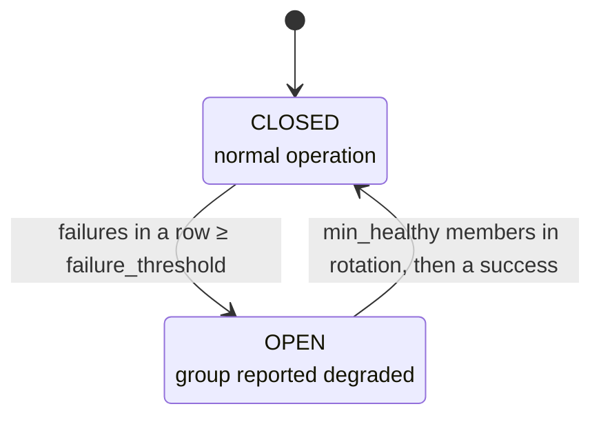

# MCP Server Groups

Aggregate multiple MCP servers behind a single virtual MCP server with load balancing, health tracking, and circuit breaker protection.

## Overview

MCP Server Groups allow you to treat multiple MCP servers as a single logical unit. MCP clients interact with the group as if it were one MCP server -- the group handles member selection, health monitoring, and failover automatically.

**Use groups when you need:**

- **High availability** -- If one MCP server fails, requests route to healthy members
- **Load distribution** -- Spread requests across multiple MCP servers using configurable strategies
- **Failover** -- Designate primary and backup MCP servers with priority-based routing
- **Capacity scaling** -- Add members to increase throughput without changing client configuration

### Group States

| State | Condition | `is_available` |
| ------- | ----------- | ---------------- |
| inactive | No member in rotation that is not `dead` | No |
| partial | Members in rotation that are not `dead` < `min_healthy` | Yes |
| healthy | Members in rotation that are not `dead` >= `min_healthy` | Yes |
| degraded | Circuit breaker open | No |

A `cold` member in rotation counts toward the state: a group starts its members
lazily, and the next call through it starts one. `healthy_count` is a separate,
reported number: the members that are `ready` and in rotation. So a group whose
members the GC reaped for being idle reads `healthy_count: 0` while it is
`healthy` and `is_available` is `true`. `members_in_rotation_count` counts the
members in rotation in any state, so `healthy_count` <= `members_in_rotation_count`
<= `total_members`.

`is_available` folds two conditions into one flag: the circuit is closed, and
at least one member is in rotation. It is not the same as a call being
accepted. A call through the group is refused only when no member is in
rotation; an open circuit on its own does not refuse it, and a group reading
`is_available: false` because its circuit is open still serves calls from the
members it has left (`select_member_for()` in
`src/mcp_hangar/domain/model/mcp_server_group.py`).

A group's state is its availability, computed from its members. It is a
separate vocabulary from a server's lifecycle state (`cold`, `initializing`,
`ready`, `degraded`, `dead`): a group is never `cold`, its members are. A
group's `degraded` means its circuit breaker is open. It is not the server
`degraded`, which is a server with failures, waiting out a backoff before it
is retried. `hangar_status` shows groups in their own section, apart from
servers, with the indicators `[HEALTHY]`, `[PARTIAL]`, `[INACTIVE]` and
`[DEGRADED]` and a `CIRCUIT` column.

## Configuration

Groups are defined in `config.yaml` alongside regular MCP servers. Set `mode: group` to create a group.

```yaml
mcp_servers:
  llm-pool:
    mode: group
    strategy: round_robin
    min_healthy: 1
    auto_start: true
    description: "LLM mcp_server pool with failover"
    members:
      - id: llm-1
        mode: subprocess
        command: [python, -m, llm_server]
      - id: llm-2
        mode: subprocess
        command: [python, -m, llm_server]
```

| Key | Type | Default | Description |
| ----- | ------ | --------- | ------------- |
| `mode` | `str` | -- | Must be `"group"` |
| `strategy` | `str` | `"round_robin"` | Load balancing strategy |
| `min_healthy` | `int` | `1` | Members in rotation, not `dead`, needed for the `healthy` state and to close an open circuit |
| `auto_start` | `bool` | `true` | Auto-start members when the group is added |
| `description` | `str` | -- | Human-readable description |
| `members` | `list[dict]` | `[]` | Member MCP server configurations |

Each member entry accepts the same keys as a regular MCP server (`mode`, `command`, `image`, `endpoint`, `env`, `idle_ttl_s`, etc.) plus group-specific keys:

| Key | Type | Default | Range | Description |
| ----- | ------ | --------- | ------- | ------------- |
| `id` | `str` | required | -- | Unique member identifier |
| `weight` | `int` | `50` | 1-100 | Weight for weighted strategies |
| `priority` | `int` | `50` | 1-100 | Priority for priority strategy (lower = higher priority) |

For the full YAML schema, see the [Configuration Reference](../reference/configuration.md).

## Load Balancing Strategies

### Round Robin

Distributes requests sequentially across all healthy members. Each member receives an equal share of traffic.

```yaml
mcp_servers:
  api-pool:
    mode: group
    strategy: round_robin
    min_healthy: 1
    members:
      - id: api-1
        mode: subprocess
        command: [python, -m, api_server]
      - id: api-2
        mode: subprocess
        command: [python, -m, api_server]
      - id: api-3
        mode: subprocess
        command: [python, -m, api_server]
```

Requests cycle through members in order: api-1, api-2, api-3, api-1, api-2, ... Unhealthy members are skipped. No weight or priority configuration applies.

**Choose round robin when** all members have similar capacity and you want even distribution.

### Weighted Round Robin

Distributes requests proportionally based on member weights using the Nginx smooth weighted round-robin algorithm. Higher weight means more requests.

```yaml
mcp_servers:
  compute-pool:
    mode: group
    strategy: weighted_round_robin
    min_healthy: 1
    members:
      - id: large-instance
        mode: remote
        endpoint: https://large.example.com/mcp
        weight: 80
      - id: small-instance
        mode: remote
        endpoint: https://small.example.com/mcp
        weight: 20
```

With weights 80 and 20, `large-instance` receives approximately 4 out of every 5 requests. The smooth weighted algorithm avoids bursts -- requests interleave rather than sending 4 consecutive requests to one member.

**Choose weighted round robin when** members have different capacities (e.g., different hardware, instance sizes).

### Least Connections

Selects the member with the oldest `last_selected_at` timestamp, effectively routing to the least recently used member. This approximates least-connections behavior by distributing requests to the member that has been idle the longest.

```yaml
mcp_servers:
  db-pool:
    mode: group
    strategy: least_connections
    min_healthy: 2
    members:
      - id: db-reader-1
        mode: remote
        endpoint: https://db1.example.com/mcp
      - id: db-reader-2
        mode: remote
        endpoint: https://db2.example.com/mcp
      - id: db-reader-3
        mode: remote
        endpoint: https://db3.example.com/mcp
```

No weight or priority configuration applies. When multiple members have the same timestamp, the first healthy member is selected.

**Choose least connections when** requests have variable duration and you want to avoid overloading a member that is still processing a long request.

### Random

Selects a random healthy member using weighted probability. Members with higher weight have a proportionally higher chance of being selected.

```yaml
mcp_servers:
  search-pool:
    mode: group
    strategy: random
    min_healthy: 1
    members:
      - id: search-primary
        mode: subprocess
        command: [python, -m, search_server]
        weight: 70
      - id: search-secondary
        mode: subprocess
        command: [python, -m, search_server]
        weight: 30
```

With weights 70 and 30, `search-primary` has a 70% probability of being selected per request. Unlike round robin, there is no guaranteed ordering -- consecutive requests may go to the same member.

**Choose random when** you want simple probabilistic distribution without the overhead of tracking request order.

### Priority

Selects the healthy member with the lowest priority number. This creates a primary/backup pattern where backup members only receive traffic when higher-priority members are unavailable.

```yaml
mcp_servers:
  llm-failover:
    mode: group
    strategy: priority
    min_healthy: 1
    members:
      - id: local-llm
        mode: subprocess
        command: [python, -m, local_llm]
        priority: 1
      - id: cloud-llm
        mode: remote
        endpoint: https://llm-api.example.com/mcp
        priority: 50
      - id: fallback-llm
        mode: remote
        endpoint: https://fallback.example.com/mcp
        priority: 99
```

All requests go to `local-llm` (priority 1) while it is healthy. If `local-llm` becomes unhealthy, requests route to `cloud-llm` (priority 50). If both are down, `fallback-llm` (priority 99) handles traffic. When `local-llm` recovers and passes health checks, it resumes as the primary.

**Choose priority when** you have a preferred MCP server and want others to serve only as backups.

## Health Policy

The group tracks each member's health independently based on consecutive successes and failures.

| Parameter | Default | Description |
| ----------- | --------- | ------------- |
| `health.unhealthy_threshold` | `2` | Consecutive failures before a member is removed from rotation |
| `health.healthy_threshold` | `1` | Consecutive successes before a member is re-added to rotation |

```yaml
mcp_servers:
  resilient-pool:
    mode: group
    strategy: round_robin
    min_healthy: 2
    health:
      unhealthy_threshold: 3
      healthy_threshold: 2
    members:
      - id: worker-1
        mode: subprocess
        command: [python, -m, worker]
      - id: worker-2
        mode: subprocess
        command: [python, -m, worker]
      - id: worker-3
        mode: subprocess
        command: [python, -m, worker]
```

### Removal and Re-entry Flow

1. A member starts in rotation (healthy)
2. Each failed health check or invocation error increments `consecutive_failures`
3. When `consecutive_failures >= unhealthy_threshold`, the member is removed from rotation
4. While removed, the member keeps receiving health checks only while its server is still `READY` — the case where the group dropped it on invocation errors. Once the server itself degrades, `health_check()` returns before it probes anything, so steps 5 and 6 cannot bring that member back; what does is the restart the recovery saga arms
5. Each successful health check increments `consecutive_successes` and resets `consecutive_failures`
6. When `consecutive_successes >= healthy_threshold` AND the MCP server state is `READY`, the member re-enters rotation

!!! note
    A member must reach the `READY` MCP server state to re-enter rotation. Health check successes alone are not sufficient -- the underlying MCP server process must be fully initialized.

The `hangar_group_rebalance` tool can be used to manually trigger a health re-evaluation of all members, re-adding recovered members and removing failed ones.

### Dead Members

A dead member is not health-checked, so steps 4 to 6 do not bring it back. What does depends on why it died:

- **Hangar gave up on it, or a capability block stopped it.** It leaves rotation, and the group never routes a call to it. A deliberate start, such as `hangar_start` on the member or on the group, puts it back, subject to `healthy_threshold`.
- **Its process crashed, or its start failed.** It stays in rotation, so the next call through the group restarts it once its backoff has passed. A restart that fails, or a call refused inside the backoff, counts as the member's failure, so a member whose restart keeps failing leaves rotation at `unhealthy_threshold` and the group fails over.

A dead member never counts as healthy. See the [dead server runbook](../runbooks/provider-dead.md).

## Circuit Breaker

The group-level circuit breaker marks a group as failing once its failures in a row reach a threshold. Opening it changes what Hangar reports -- the group's state, `circuit_open`, `is_available` and `mcp_hangar_group_circuit_open` -- and sets the `min_healthy` bar the group has to clear again before it closes. It does not halt requests: nothing on the call path asks the breaker, so a member still in rotation is still selected and still serves calls.

| Parameter | Default | Description |
| ----------- | --------- | ------------- |
| `circuit_breaker.failure_threshold` | `10` | Failures in a row, across the group's members, before the circuit opens. A success ends the run |

```yaml
mcp_servers:
  protected-pool:
    mode: group
    strategy: weighted_round_robin
    min_healthy: 1
    circuit_breaker:
      failure_threshold: 5
    members:
      - id: svc-1
        mode: remote
        endpoint: https://svc1.example.com/mcp
        weight: 60
      - id: svc-2
        mode: remote
        endpoint: https://svc2.example.com/mcp
        weight: 40
```

### Circuit Breaker States



- **CLOSED** -- Normal operation. Requests are routed to healthy members. Each failure reported for a member, a failed call through the group or a failed health check, adds to the run. Any success ends it.
- **OPEN** -- The group enters the `degraded` state, `circuit_open` reads `true`, `is_available` reads `false`, and `mcp_hangar_group_circuit_open` reads 1 for this replica. Member selection still occurs, and calls are still served: the breaker never vetoes a member that is in rotation, so a primary whose failures opened the circuit does not take a healthy backup down with it. A call is refused, with `NoAvailableMemberError`, only when no member is left in rotation -- which is when the group is genuinely down.
- **Closing** -- The circuit closes once `min_healthy` members are back in rotation and one of them reports a success. Three things report one: a passing health check, a call that succeeded, and a completed start -- every successful start records `McpServerStarted` (`_finalize_start()` in `src/mcp_hangar/domain/model/mcp_server.py` is the only path to `ready`), and `GroupRebalanceSaga` reports it to each of the member's groups as a success. There is no timer: however long the circuit has been open, waiting alone does not close it, and it never half-opens. A dead member is not health-checked, so if too few live members remain, the circuit stays open until dead ones are started deliberately or `hangar_group_rebalance` resets it.

!!! warning
    The run counts failures across all members, so a burst of errors from one member can open the circuit while other members are healthy, if nothing succeeds in between.

The `hangar_group_rebalance` tool resets the circuit breaker immediately.

!!! note
    `circuit_breaker.reset_timeout_s` was removed in 2.20.0. It never had an effect: an open group circuit did not half-open once the timeout passed, because a group never asks its breaker whether to let a request through. A config that still sets it loads and logs `unknown_config_key` naming the group and the key. `HANGAR_CONFIG_STRICT=1` and `mcp-hangar config check` refuse it, so under strict mode a gateway whose config still sets it does not start. Delete the key.

### More Than One Replica

Each replica keeps its own circuit breaker for a group, so replicas can disagree. A replica whose circuit is open reports the group `degraded` while the others report it healthy; it keeps serving calls from the members it still has in rotation, and refuses with `NoAvailableMemberError` only when it has none. `circuit_open` in `hangar_group_list` and `hangar_status` answers for the replica that served the call. `mcp_hangar_group_circuit_open` is scraped from every replica, and the scrape's `instance` label tells them apart. Alert on disagreement, not only on an open circuit.

```promql
# Groups the replicas disagree about: open on at least one, closed on another.
max by (group) (mcp_hangar_group_circuit_open) - min by (group) (mcp_hangar_group_circuit_open) > 0

# Groups whose circuit is open on at least one replica.
max by (group) (mcp_hangar_group_circuit_open) == 1

# Which replicas have a group's circuit open.
mcp_hangar_group_circuit_open == 1
```

- If several Hangar deployments share one Prometheus, add the label that separates them (for example `job` or `namespace`) to each `by (...)`.
- A replica that has not loaded the group has no series and does not count. A replica that is down drops out once its series go stale.
- For an alert, give the disagreement query a `for:` clause, for example `for: 5m`, so a transition that one scrape catches mid-flight does not page.

See [Observability → Group Circuit Breaker](OBSERVABILITY.md#group-circuit-breaker).

## Per-Tenant Canary Routing

MCP Hangar 1.4.0 can route tenants to specific group members before applying
the normal load-balancing strategy. This is useful for canary releases, version
pinning, and controlled tenant migrations.

```yaml
mcp_servers:
  search:
    mode: group
    strategy: weighted_round_robin
    canary:
      member: search-v2
      split_pct: 10
      pinned_tenants:
        "tenant:beta": search-v2
        "tenant:legacy": search-v1
    members:
      - id: search-v1
        mode: remote
        endpoint: https://search-v1.example.com/mcp
        weight: 90
      - id: search-v2
        mode: remote
        endpoint: https://search-v2.example.com/mcp
        weight: 10
```

Resolution order:

1. `canary.pinned_tenants` sends an explicit tenant to the named member.
2. `canary.split_pct` sends a deterministic percentage of tenant IDs to `canary.member`.
3. All other traffic uses the configured group strategy.

The split is sticky across processes because it hashes `tenant_id`; a tenant in
the 10% bucket keeps routing to the canary member until the policy changes.
Canary routing only applies when the caller identity has a tenant ID. If the
pinned or canary member is not in rotation, Hangar falls back to the normal load
balancer instead of routing to an unavailable member.

| Key | Type | Default | Description |
| ----- | ------ | --------- | ------------- |
| `canary.member` | `str` | -- | Group member that receives split traffic |
| `canary.split_pct` | `int` | `0` | Percentage of tenants routed to `canary.member` (`0`--`100`) |
| `canary.pinned_tenants` | `dict[str, str]` | `{}` | Tenant ID to member ID pins |

## Tool Access Filtering

Tool access filtering controls which tools are visible when invoking a group or its members. Filters use a three-level policy hierarchy with fnmatch glob pattern matching (`*`, `?`, `[seq]`).

### Policy Hierarchy

1. **MCP Server-level** -- Applied to the MCP server's own tool list
2. **Group-level** -- Applied to the group as a whole
3. **Member-level** -- Applied per member within the group

### Configuration

```yaml
mcp_servers:
  secure-pool:
    mode: group
    strategy: round_robin
    tools:
      allow_list: ["query_*", "search_*"]
      deny_list: []
    members:
      - id: full-access
        mode: subprocess
        command: [python, -m, data_server]
        tools:
          allow_list: []
          deny_list: ["admin_*"]
      - id: read-only
        mode: subprocess
        command: [python, -m, data_server]
        tools:
          allow_list: ["query_*"]
          deny_list: []
```

Individual MCP servers can also define tool access policies:

```yaml
mcp_servers:
  restricted-mcp-server:
    mode: subprocess
    command: [python, -m, server]
    tools:
      allow_list: ["safe_*"]
      deny_list: []
```

### Resolution Rules

| Condition | Behavior |
| ----------- | ---------- |
| `allow_list` is set (non-empty) | Only tools matching an allow pattern are visible |
| `allow_list` is empty, `deny_list` is set | All tools visible except those matching a deny pattern |
| Both empty | All tools visible |
| Both set | `allow_list` takes precedence; `deny_list` is ignored |

Patterns use Python's `fnmatch` module:

- `*` matches everything
- `?` matches any single character
- `[seq]` matches any character in `seq`
- `[!seq]` matches any character not in `seq`
