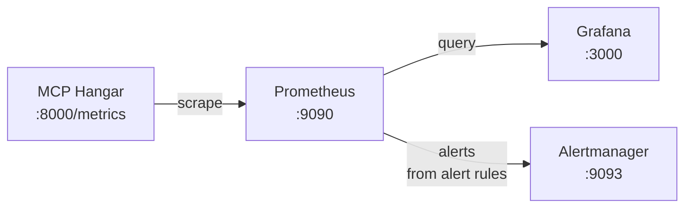

# Observability Guide

> **New to this?** [Governance observability](https://mcp-hangar.io/learn/governance-observability) is the concept behind this page.

This guide covers MCP Hangar's observability features: metrics, tracing, logging, and health checks.

## Table of Contents

- [Quick Start](#quick-start)
- [Monitoring Stack](#monitoring-stack)
- [Metrics](#metrics)
- [Grafana Dashboards](#grafana-dashboards)
- [Alerting](#alerting)
- [Tracing](#tracing)
- [Langfuse Integration](#langfuse-integration)
- [Logging](#logging)
- [Health Checks](#health-checks)
- [SLIs/SLOs](#slisslos)
- [Troubleshooting](#troubleshooting)
- [Best Practices](#best-practices)

## Quick Start

### Prerequisites

```bash
# Core package
pip install mcp-hangar

# For full observability support -- these are two separate extras
pip install mcp-hangar[opentelemetry,langfuse]
```

### Ship the Dashboards and Alerts

MCP Hangar does not ship a monitoring stack. Bring your own Prometheus and
Grafana; what Hangar maintains is the payloads that go into them, and those
ship with the Helm chart:

```bash
helm upgrade --install hangar mcp-hangar/mcp-hangar \
  --set serviceMonitor.enabled=true \
  --set prometheusRule.enabled=true \
  --set dashboards.enabled=true
```

See [Monitoring Stack](#monitoring-stack) for what each value renders and where
the payloads live.

### Start MCP Hangar with Metrics

```bash
# HTTP mode (exposes /metrics endpoint)
mcp-hangar serve --http --host 127.0.0.1 --port 8000

# With custom config
MCP_CONFIG=config.yaml mcp-hangar serve --http --host 127.0.0.1 --port 8000
```

Without authentication configured, `serve --http` refuses to bind its default
host `0.0.0.0`; bind the loopback address for a local run.

Verify metrics are exposed:

```bash
curl http://localhost:8000/metrics | grep mcp_hangar
```

## Monitoring Stack

### Architecture



### What Hangar Ships, and What You Bring

Prometheus, Grafana and Alertmanager are yours to run. Hangar maintains the
three payloads that go into them, and the [`mcp-hangar` Helm
chart](https://github.com/mcp-hangar/helm-charts) is the only place they ship
from:

| What | Chart value | Renders | Source |
| ------ | ------------- | --------- | -------- |
| Scrape target | `serviceMonitor.enabled=true` | a `ServiceMonitor` (needs the Prometheus Operator) | the chart |
| Alert rules | `prometheusRule.enabled=true` | a `PrometheusRule` with 29 rules | [`mcp-hangar/files/prometheus-alerts.yaml`](https://github.com/mcp-hangar/helm-charts/blob/main/mcp-hangar/files/prometheus-alerts.yaml) |
| Dashboards | `dashboards.enabled=true` | four ConfigMaps labelled `grafana_dashboard` for the Grafana sidecar | [`mcp-hangar/files/dashboards/`](https://github.com/mcp-hangar/helm-charts/tree/main/mcp-hangar/files/dashboards) |

Everything else is your own: a raw Prometheus scrape config, Alertmanager
routing, and Grafana provisioning are **not shipped in any form**. The examples
below are illustrations of what to write, not files you can copy from this
project.

### Prometheus Configuration

Without the Prometheus Operator, scrape the gateway directly:

```yaml
scrape_configs:
  - job_name: 'mcp-hangar'
    static_configs:
      - targets: ['host.docker.internal:8000']
        labels:
          service: 'mcp-hangar'
          tier: 'application'
    metrics_path: /metrics
    scrape_interval: 10s
    scrape_timeout: 5s
```

On Kubernetes, prefer `serviceMonitor.enabled=true`. If you are not running the
Prometheus Operator, use service discovery:

```yaml
scrape_configs:
  - job_name: 'mcp-hangar'
    kubernetes_sd_configs:
      - role: pod
    relabel_configs:
      - source_labels: [__meta_kubernetes_pod_label_app]
        regex: mcp-hangar
        action: keep
```

## Metrics

MCP Hangar exports Prometheus metrics at `/metrics`. All metrics use the `mcp_hangar_` prefix.

### Currently Exported Metrics

#### Tool Invocations

| Metric | Type | Labels | Description |
| -------- | ------ | -------- | ------------- |
| `mcp_hangar_tool_calls_total` | Counter | MCP server, tool, status | Total tool invocations |
| `mcp_hangar_tool_call_duration_seconds` | Histogram | MCP server, tool | Invocation latency (buckets: 0.001-30s) |
| `mcp_hangar_tool_call_errors_total` | Counter | MCP server, tool, error_type | Failed invocations by error type |

**Example queries:**

```promql
# Tool call rate by mcp_server
sum(rate(mcp_hangar_tool_calls_total[5m])) by (mcp_server)

# P95 latency by tool
histogram_quantile(0.95, sum(rate(mcp_hangar_tool_call_duration_seconds_bucket[5m])) by (le, tool))

# Error rate
sum(rate(mcp_hangar_tool_call_errors_total[5m])) / sum(rate(mcp_hangar_tool_calls_total[5m]))
```

#### Batch Invocations

| Metric | Type | Labels | Description |
| -------- | ------ | -------- | ------------- |
| `mcp_hangar_batch_calls_total` | Counter | result | Batch invocations (`success`, `failure`, `partial`) |
| `mcp_hangar_batch_duration_seconds` | Histogram | - | Batch execution time |
| `mcp_hangar_batch_size` | Histogram | - | Number of calls per batch |
| `mcp_hangar_batch_cancellations_total` | Counter | reason | Cancelled batches (`timeout`, `fail_fast`) |
| `mcp_hangar_batch_circuit_breaker_rejections_total` | Counter | mcp_server | Circuit breaker rejections |
| `mcp_hangar_batch_concurrency` | Gauge | - | Current parallel executions |

**Example queries:**

```promql
# Batch success rate
sum(rate(mcp_hangar_batch_calls_total{result="success"}[5m]))
/ sum(rate(mcp_hangar_batch_calls_total[5m]))

# Average batch size
rate(mcp_hangar_batch_size_sum[5m]) / rate(mcp_hangar_batch_size_count[5m])
```

#### Health Checks

| Metric | Type | Labels | Description |
| -------- | ------ | -------- | ------------- |
| `mcp_hangar_health_checks_total` | Counter | MCP server, result | Health check executions |
| `mcp_hangar_health_check_duration_seconds` | Histogram | MCP server | Health check latency |
| `mcp_hangar_health_check_consecutive_failures` | Gauge | MCP server | Current consecutive failure count |

**Example queries:**

```promql
# Unhealthy mcp_servers (>2 consecutive failures)
mcp_hangar_health_check_consecutive_failures > 2

# Health check success rate
sum(rate(mcp_hangar_health_checks_total{result="healthy"}[5m])) by (mcp_server)
/ sum(rate(mcp_hangar_health_checks_total[5m])) by (mcp_server)
```

#### MCP Server Lifecycle

| Metric | Type | Labels | Description |
| -------- | ------ | -------- | ------------- |
| `mcp_hangar_mcp_server_state` | Gauge | mcp_server | Current state (0=cold, 1=initializing, 2=ready, 3=degraded, 4=dead) |
| `mcp_hangar_mcp_server_up` | Gauge | mcp_server | 1 while the MCP server is `ready`, 0 in every other state |
| `mcp_hangar_mcp_server_starts_total` | Counter | mcp_server, result | MCP server start attempts |
| `mcp_hangar_mcp_server_initialized` | Gauge | mcp_server | 0 while the MCP server is `cold`, 1 in every other state, `dead` included |
| `mcp_hangar_mcp_server_last_healthy_timestamp_seconds` | Gauge | mcp_server | When Hangar last saw the MCP server working: a passing health check, a completed start or a successful tool call. Kept when it goes cold or dead |
| `mcp_hangar_mcp_server_cold_start_seconds` | Histogram | mcp_server, mode | Cold start latency |
| `mcp_hangar_mcp_server_cold_start_in_progress` | Gauge | mcp_server | 1 if cold start is in progress |

*`mcp_hangar_mcp_server_last_healthy_timestamp_seconds` since 2.20.0.*

`dead` (4) is a server that failed and is not running, and nothing restarts it
on its own: health checks skip it, and the recovery saga has cancelled its
restarts. The recovery saga gave up on it, its process crashed, its start
failed, or a capability block stopped it. Since 2.20.0 all four read `4`. `0`
means only that the server is not running and is not failing: never started,
stopped, or reaped for being idle. So do not alert on `state == 0`. Because
health checks skip a dead server, its `mcp_hangar_health_checks_total` stops
moving. `dead` is not terminal: the [dead server
runbook](../runbooks/provider-dead.md) says what starts one again.

**Example queries:**

```promql
# Dead MCP servers: given up on, crashed, failed to start, or stopped by a capability block
mcp_hangar_mcp_server_state == 4

# Not seen working for 15 minutes, leaving out servers that are cold
time() - mcp_hangar_mcp_server_last_healthy_timestamp_seconds > 900
  unless mcp_hangar_mcp_server_state == 0
```

Keep the `unless`, and keep its default matching. A cold server is not probed,
so its value ages, and without the `unless` the rule fires for every server
reaped for being idle more than 15 minutes ago. `unless on(mcp_server)` would
drop the `instance` label, so with more than one replica a server that is cold
on one replica would hide it being dead on another. A server that was never
healthy has no series, so pair the rule with `state == 4`.

`sum(mcp_hangar_mcp_server_up) == 0` can fire where it did not before 2.20.0: a
crashed server reads `up` 0, where it used to keep reading 1.

#### Group Circuit Breaker

*Since 2.20.0.*

| Metric | Type | Labels | Description |
| -------- | ------ | -------- | ------------- |
| `mcp_hangar_group_circuit_open` | Gauge | group | 1 while this replica has the group's circuit breaker open, 0 otherwise |

Each replica keeps its own circuit breaker for a group, so replicas can
disagree. A replica whose circuit is open reports the group `degraded` while
the others report it healthy; it keeps serving calls from the members it still
has in rotation, and refuses with `NoAvailableMemberError` only when it has
none.
`mcp_hangar_group_circuit_open` is scraped from every replica, and the scrape's
`instance` label tells them apart. Alert on disagreement, not only on an open
circuit.

**Example queries:**

```promql
# Groups the replicas disagree about: open on at least one, closed on another.
max by (group) (mcp_hangar_group_circuit_open) - min by (group) (mcp_hangar_group_circuit_open) > 0

# Groups whose circuit is open on at least one replica.
max by (group) (mcp_hangar_group_circuit_open) == 1

# Which replicas have a group's circuit open.
mcp_hangar_group_circuit_open == 1
```

- If several Hangar deployments share one Prometheus, add the label that
  separates them (for example `job` or `namespace`) to each `by (...)`.
- A replica that has not loaded the group has no series and does not count. A
  replica that is down drops out once its series go stale. Since 2.23.0, a
  configuration reload that removes a group drops that
  group's series, so a group removed with its circuit open no longer reads as
  open for good.
- For an alert, give the disagreement query a `for:` clause, for example
  `for: 5m`, so a transition that one scrape catches mid-flight does not page.

The gauge is 0 or 1, not a closed/half-open/open enum, because a group never
half-opens its circuit. On one replica it agrees with `circuit_open` in
`hangar_group_list`. This gauge is the supported way to see replicas diverge:
the breaker threshold counts failures per replica, and every group read
answers for one replica. See
[MCP Server Groups](MCP_SERVER_GROUPS.md#more-than-one-replica).

#### Discovery

| Metric | Type | Labels | Description |
| -------- | ------ | -------- | ------------- |
| `mcp_hangar_discovery_mcp_servers` | Gauge | source_type, status | Discovered MCP servers per source |
| `mcp_hangar_discovery_registrations_total` | Counter | source_type | New registrations |
| `mcp_hangar_discovery_errors_total` | Counter | source_type, error_type | Errors by source |
| `mcp_hangar_discovery_cycle_duration_seconds` | Histogram | source_type | Discovery cycle duration |

#### HTTP Transport

| Metric | Type | Labels | Description |
| -------- | ------ | -------- | ------------- |
| `mcp_hangar_http_requests_total` | Counter | mcp_server, method, status_code | HTTP requests to remote MCP servers |
| `mcp_hangar_http_request_duration_seconds` | Histogram | mcp_server, method | HTTP request latency |

#### Messages (stdio + HTTP)

| Metric | Type | Labels | Description |
| -------- | ------ | -------- | ------------- |
| `mcp_hangar_messages_sent_total` | Counter | mcp_server, method | JSON-RPC messages sent to an upstream server |
| `mcp_hangar_messages_received_total` | Counter | mcp_server, type | JSON-RPC messages received (`type`: response/notification/error) |
| `mcp_hangar_message_size_bytes` | Histogram | mcp_server, direction | JSON-RPC message payload size (`direction`: sent/received) |

#### Rate Limiting

| Metric | Type | Labels | Description |
| -------- | ------ | -------- | ------------- |
| `mcp_hangar_rate_limit_hits_total` | Counter | result | Rate limiter decisions: `allowed` or `rejected` |

#### Approval Gate

*Since 2.7.0.*

| Metric | Type | Labels | Description |
| -------- | ------ | -------- | ------------- |
| `mcp_hangar_approval_requests_total` | Counter | channel | Tool invocations held by the gate |
| `mcp_hangar_approval_deliveries_total` | Counter | channel, outcome | Notifications handed to a channel: `sent`, `failed`, `not_notified` |
| `mcp_hangar_approval_decisions_total` | Counter | channel, decision | How each hold ended: `granted`, `denied`, `expired` |

**Example queries:**

```promql
# Armed and unmanned: the gate is holding calls and nobody is being told.
sum(rate(mcp_hangar_approval_requests_total[15m])) by (channel)
  - sum(rate(mcp_hangar_approval_deliveries_total{outcome="sent"}[15m])) by (channel)

# The same story from the other end: holds ending in expiry rather than a decision.
sum(rate(mcp_hangar_approval_decisions_total{decision="expired"}[1h])) by (channel)
  / sum(rate(mcp_hangar_approval_decisions_total[1h])) by (channel)

# A configured adapter that is failing rather than absent.
sum(rate(mcp_hangar_approval_deliveries_total{outcome="failed"}[5m])) by (channel)
```

`outcome="not_notified"` tracking requests one-for-one means the resolved
channel reaches nothing outside the process. That is not an outage — held calls
still expire closed and stay resolvable over REST — but every gated call waits
out its timeout first, which from the client side looks like a broken gateway.
The startup check reports the same condition at boot; see
[Configuration → `approvals`](../reference/configuration.md#notification-channels-approvals).

#### Front Door Projection

*`mcp_hangar_projected_surface_bytes`, `mcp_hangar_projected_upstream_bytes` and
`mcp_hangar_projection_changes_total` since 2.20.0.*

What a `front_door` gateway hands a client in `tools/list`, which sits in the
client's context on every turn. Only listings the client received are measured:
the SDK's own listing before a `tools/call` is not. None of these carries a tenant
label: a public front door has unbounded tenant cardinality.

| Metric | Type | Labels | Description |
| -------- | ------ | -------- | ------------- |
| `mcp_hangar_projected_tools` | Histogram | kind | Tools per listing: `governed` (upstream) or `management` (`hangar_*`) |
| `mcp_hangar_projected_surface_bytes` | Histogram | kind | Bytes of tool definitions per listing, as compact JSON |
| `mcp_hangar_projected_upstream_bytes` | Histogram | mcp_server | Bytes one upstream adds to a listing that includes it; a group reads as its group id |
| `mcp_hangar_projection_changes_total` | Counter | - | Listings whose projection differed from the one the same caller was last served on this replica |

**Example queries:**

```promql
# Did the projection served to any caller change on this replica in the last hour?
increase(mcp_hangar_projection_changes_total[1h]) > 0

# Tools a client is handed per listing, by kind
sum(rate(mcp_hangar_projected_tools_sum[5m])) by (kind) / sum(rate(mcp_hangar_projected_tools_count[5m])) by (kind)

# Bytes of tool definitions a client is handed per listing, by kind
sum(rate(mcp_hangar_projected_surface_bytes_sum[5m])) by (kind) / sum(rate(mcp_hangar_projected_surface_bytes_count[5m])) by (kind)

# 95th percentile of the governed surface one listing carries
histogram_quantile(0.95, sum(rate(mcp_hangar_projected_surface_bytes_bucket{kind="governed"}[5m])) by (le))

# What the surface is made of: bytes each upstream adds to a listing that includes it
sum(rate(mcp_hangar_projected_upstream_bytes_sum[5m])) by (mcp_server) / sum(rate(mcp_hangar_projected_upstream_bytes_count[5m])) by (mcp_server)
```

A change is counted when a caller lists again and is served something different
from what it was served before. The caller is the same tenant and principal,
and the same session when there is one. It covers a tool added, removed, routed
elsewhere or redefined, and the first listing after the warm-up lands. The
count is per replica and per caller. A caller's first listing on a replica is
not a change, and neither is the first listing of a caller the replica stopped
remembering. The memory holds 1024 callers, least recently served forgotten
first. So the counter can miss a change, but it never counts one that did not
happen. A client behind a load balancer without affinity may see a change
that no replica counted.

Keep `/metrics` off a public front door. It answers on the same port as `/mcp`,
it is exempt from authentication by default, and these series name every
upstream the gateway serves. Route only `/mcp` through the public edge and
scrape `/metrics` from inside the network; see
[Harden a public gateway](../cookbook/23-harden-public-gateway.md).

#### GC (Garbage Collection)

| Metric | Type | Labels | Description |
| -------- | ------ | -------- | ------------- |
| `mcp_hangar_gc_cycles_total` | Counter | - | GC cycle executions |
| `mcp_hangar_gc_cycle_duration_seconds` | Histogram | - | GC cycle duration |

## Grafana Dashboards

Four maintained dashboards ship with the Helm chart. `dashboards.enabled=true`
renders each as a ConfigMap labelled `grafana_dashboard`, which the Grafana
sidecar imports on its own; the JSON lives in
[`mcp-hangar/files/dashboards/`](https://github.com/mcp-hangar/helm-charts/tree/main/mcp-hangar/files/dashboards).

### Overview Dashboard

**File:** `overview.json`
**URL:** http://localhost:3000/d/mcp-hangar-overview

Provides high-level system health:

- Request rate and error rate trends
- Latency percentiles (P50, P95, P99)
- MCP Server health status
- Batch invocation success/failure rates
- Health check results
- GC cycle performance

### MCP Server Details Dashboard

**File:** `provider-details.json`
**URL:** http://localhost:3000/d/mcp-hangar-provider

Deep dive into individual MCP servers:

- Tool call breakdown by tool name
- Per-tool latency histograms
- Error distribution by type
- Health check history
- Consecutive failure tracking

### Alerts Dashboard

**File:** `alerts.json`
**URL:** http://localhost:3000/d/mcp-hangar-alerts

Alert monitoring and trends:

- Active alerts by severity
- Alert condition trends (error rate, latency, health)
- Historical alert timeline

### Governance Dashboard

**File:** `governance.json`
**URL:** http://localhost:3000/d/mcp-hangar-governance

MCP Hangar 1.4.0 adds a governance dashboard for tenant and policy operations:

- Cost attribution by MCP server, tool, and cost model
- Capability violations, tool schema drifts, detection rule matches, and enforcement actions
- Tool access denials, filtered tools, and active tool-access policies
- Batch in-flight calls, concurrency queueing, P95 wait time, and circuit-breaker state

### Importing Dashboards Manually

If you are not running the Grafana sidecar:

1. Download the JSON from [`mcp-hangar/files/dashboards/`](https://github.com/mcp-hangar/helm-charts/tree/main/mcp-hangar/files/dashboards) in the helm-charts repo
2. Open Grafana at http://localhost:3000
3. Go to Dashboards > Import
4. Upload the JSON file
5. Select Prometheus data source
6. Click Import

## Alerting

### Alert Configuration

The 29 maintained alert rules ship with the Helm chart. `prometheusRule.enabled=true`
renders them as a `PrometheusRule` CR, which needs the Prometheus Operator CRDs
installed; the source is
[`mcp-hangar/files/prometheus-alerts.yaml`](https://github.com/mcp-hangar/helm-charts/blob/main/mcp-hangar/files/prometheus-alerts.yaml).
They are organized by severity:

#### Critical Alerts (Page On-Call)

| Alert | Condition | For | Description |
| ------- | ----------- | ----- | ------------- |
| `MCPHangarNotResponding` | `up{job="mcp-hangar"} == 0` | 1m | Service unreachable |
| `MCPHangarHighErrorRate` | Error rate > 10% | 2m | Significant failures |
| `MCPHangarBatchHighFailureRate` | Batch failure > 20% | 3m | Batch operations failing |
| `MCPHangarCircuitBreakerTripped` | CB rejections > 10/5m | 2m | MCP Server isolated |
| `MCPHangarAllProvidersDown` | No MCP server up, and at least one dead | 1m | Total outage |
| `MCPHangarProviderDead` | MCP server state = DEAD (4) | 1m | MCP server failed and nothing restarts it on its own; see [provider-dead](../runbooks/provider-dead.md) |

#### Warning Alerts (Investigate)

| Alert | Condition | For | Description |
| ------- | ----------- | ----- | ------------- |
| `MCPHangarHighConsecutiveFailures` | Consecutive failures >= 1 | 2m | Health check issues |
| `MCPHangarHealthCheckSlow` | P95 health check > 5s | 5m | Slow health checks |
| `MCPHangarHighLatencyP95` | P95 latency > 3s | 5m | Performance degradation |
| `MCPHangarHighLatencyP99` | P99 latency > 5s | 5m | Tail latency issues |
| `MCPHangarHighLatencyByTool` | P95 per-tool > 5s | 5m | Specific tool slow |
| `MCPHangarFrequentColdStarts` | Start rate > 0.1/s | 10m | Consider increasing idle_ttl |
| `MCPHangarBatchSlowExecution` | P95 batch > 30s | 5m | Slow batch processing |
| `MCPHangarBatchHighCancellationRate` | Cancellation > 10% | 5m | Batches timing out |
| `MCPHangarBatchSizeTooLarge` | P95 size > 50 | 5m | Consider smaller batches |
| `MCPHangarGCSlowCycles` | P95 GC > 0.5s | 5m | GC performance issue |
| `MCPHangarHighMemoryUsage` | Memory > 2GB | 10m | Memory pressure |
| `MCPHangarHighCPUUsage` | CPU > 80% | 10m | CPU saturation |
| `MCPHangarTelemetryExportFailing` | OTLP export failures > 0 | 10m | Traces or audit records are not reaching the collector |
| `MCPHangarDiscoveryValidationFailing` | Discovery validation failures > 0 | 15m | Discovered servers are being rejected |
| `MCPHangarProviderDegraded` | MCP server state = DEGRADED | 5m | MCP Server degraded |
| `MCPHangarProviderNotSeenHealthy` | Not seen working for 15m, and not cold | 5m | MCP server not working; see [provider-dead](../runbooks/provider-dead.md) |
| `MCPHangarRemoteProviderUnreachable` | Connection-refused errors > 10/5m | 5m | Remote MCP server unreachable |
| `MCPHangarDiscoverySourceUnhealthy` | No healthy discovery sources | 5m | Discovery sources down |
| `MCPHangarHighRateLimitRejections` | Rejected rate-limit hits > 1/s | 5m | Clients being throttled |
| `MCPHangarCapabilityViolations` | Capability violations > 0/5m | 5m | Security: capability breach |
| `MCPHangarConcurrencyQueueBuildup` | Concurrency queue building > 1/5m | 5m | Backpressure / saturation |

`MCPHangarProviderDead` and `MCPHangarProviderNotSeenHealthy` need Hangar 2.20.0
or later. Before it, a server Hangar gave up on read `cold`, and the last-healthy
gauge did not exist. When the recovery saga gives up, the server moves from
DEGRADED to DEAD, so `MCPHangarProviderDegraded` resolves as
`MCPHangarProviderDead` fires.

#### Governance and Availability Alert Groups

1.4.0 adds two dedicated Prometheus groups:

- `mcp-hangar-governance` -- security, policy/enforcement, and concurrency saturation signals. (Cost is tracked on the governance dashboard but is not alerted.)
- `mcp-hangar-availability` -- MCP server state, discovery health, remote transport errors, and runtime rate limiting.

Use these groups when routing alerts to different teams; for example, security
teams can subscribe to governance alerts while platform on-call owns
availability and transport alerts.

#### Info Alerts (Tracking)

| Alert | Condition | Description |
| ------- | ----------- | ------------- |
| `MCPHangarProviderStarted` | Any MCP server start | MCP Server lifecycle event |
| `MCPHangarHighToolCallVolume` | Rate > 100/s | High traffic notification |

### Alertmanager Configuration

Hangar ships no Alertmanager configuration — routing is yours. The rules above
carry `severity` labels, so a routing tree keyed on them works out of the box:

```yaml
route:
  group_by: ['alertname', 'severity']
  group_wait: 30s
  group_interval: 5m
  repeat_interval: 4h
  receiver: 'default'
  routes:
    - match:
        severity: critical
      receiver: 'pagerduty'
    - match:
        severity: warning
      receiver: 'slack'

receivers:
  - name: 'default'
    webhook_configs:
      - url: 'http://your-webhook-endpoint'

  - name: 'pagerduty'
    pagerduty_configs:
      - service_key: '<your-service-key>'

  - name: 'slack'
    slack_configs:
      - api_url: '<your-slack-webhook-url>'
        channel: '#mcp-hangar-alerts'
        title: '{{ .CommonAnnotations.summary }}'
        text: '{{ .CommonAnnotations.description }}'
```

### Testing Alerts

Verify alert rules are loaded:

```bash
# Check Prometheus rules
curl -s http://localhost:9090/api/v1/rules | jq '.data.groups[].rules[].name'

# Check for firing alerts
curl -s http://localhost:9090/api/v1/alerts | jq '.data.alerts[] | select(.state=="firing")'
```

## Tracing

### OpenTelemetry Integration

MCP Hangar supports distributed tracing via OpenTelemetry. Every tool invocation
produces a `batch.call.<tool>` span carrying MCP governance attributes
(`mcp.server.id`, `gen_ai.tool.name`, `hangar.call.outcome`, the route and, for
a refused call, the refusal's gate and reason), and an `execute_tool <tool>`
CLIENT span for the upstream call. Caller type and tenant are added when the
call has an identity; the caller's user, agent and session ids only with
`observability.tracing.caller_ids: true` (or `MCP_TRACING_CALLER_IDS=true`),
which is off by default.

For the full MCP attribute taxonomy, partner backend recipes (OTEL Collector,
OpenLIT, Langfuse, Grafana), and reference docker-compose setups, see:
**[OpenTelemetry Integrations](../observability/otel-integrations.md)**.

```python
from mcp_hangar.observability import init_tracing, trace_span

# Initialize once at startup
init_tracing(
    service_name="mcp-hangar",
    otlp_endpoint="http://localhost:4317",
)

# Create spans for operations
with trace_span("process_request", {"request.id": req_id}) as span:
    span.add_event("checkpoint_reached")
    result = do_work()
```

### MCP Governance Attributes on Spans

The gateway sets these attributes itself, on `batch.call.<tool>`, for every call
that goes through `hangar_call`, a front-door tool call or the facade's
`invoke`. There is nothing to construct or wire. `TracedMcpServerService`, which
earlier versions of this page showed here, was removed in 2.22.0, and the
`set_governance_attributes` helper in 2.24.0.

### OTLP Audit Export

Security-relevant domain events (tool invocations, refusals, MCP server state
transitions) are automatically exported as OTLP log records when an OTLP endpoint
is set explicitly, with `OTEL_EXPORTER_OTLP_ENDPOINT` or
`observability.tracing.otlp_endpoint`. This is handled by `OTLPAuditExporter` and
`OTLPAuditEventHandler` -- no additional configuration needed.
`observability.audit.enabled: false` (or `MCP_AUDIT_EXPORT_ENABLED=false`) turns
it off.

Events exported:

- `ToolInvocationCompleted` / `ToolInvocationFailed` -- with MCP server, tool, status, duration, caller identity, cost attribution
- `ToolCallRefused` -- a call a control refused, with `mcp.tool.status=denied` and the refusing gate and reason
- `McpServerStateChanged` -- with MCP server, from_state, to_state

Caller identity attributes (`mcp.caller.type`, `mcp.caller.id`, `mcp.caller.roles`)
are automatically propagated from the event's `identity_context` when available.

Cost attributes (`mcp.cost.cents`, `mcp.cost.model`, `gen_ai.usage.input_tokens`,
`gen_ai.usage.output_tokens`) are included when cost attribution is configured.

### Compliance Export Formats

MCP Hangar can export audit events in SIEM-compatible formats alongside
OTLP. Available exporters (in `src/mcp_hangar/compliance/`):

| Format | Class | Use Case |
| -------- | ------- | ---------- |
| CEF | `CEFExporter` | ArcSight, QRadar, Splunk via CEF |
| JSON-lines | `JSONLinesExporter` | Splunk HEC, Elasticsearch, custom pipelines |
| LEEF | `LEEFExporter` | IBM QRadar native format |
| Syslog (RFC 5424) | `SyslogExporter` | Any syslog-compatible SIEM |

All exporters implement the `IAuditExporter` protocol and output to file, callback,
or stderr (for container log collection). Select one with `MCP_COMPLIANCE_FORMAT`
(`cef`, `leef`, `jsonlines` or `syslog`) and point it at a file with
`MCP_COMPLIANCE_OUTPUT`; without it, records go to stderr.

### Environment Variables

| Variable | Default | Description |
| ---------- | --------- | ------------- |
| `MCP_TRACING_ENABLED` | `true` | Enable/disable tracing |
| `OTEL_EXPORTER_OTLP_ENDPOINT` | `http://localhost:4317` | OTLP collector endpoint (also activates OTLP audit export) |
| `OTEL_SERVICE_NAME` | `mcp-hangar` | Service name in traces |
| `MCP_TRACING_CALLER_IDS` | `false` | Put caller user, agent and session ids on spans; overrides `observability.tracing.caller_ids` |

### Trace Context Propagation

W3C TraceContext is automatically propagated across agent -> Hangar -> MCP server
boundaries:

- **Inbound:** `BatchExecutor` extracts `traceparent` from the inbound request's
  `params._meta` and from call metadata, creating child spans linked to the
  agent's root trace.
- **Outbound HTTP:** `HttpClient` injects `traceparent` into the outbound HTTP
  headers and into `params._meta` when calling remote MCP servers.
- **Outbound stdio:** `traceparent` travels in `params._meta` (SEP-414), since
  JSON-RPC over stdin/stdout has no headers.

Manual propagation is also available:

```python
from mcp_hangar.observability import inject_trace_context, extract_trace_context

# Inject into outgoing requests
headers = {}
inject_trace_context(headers)

# Extract from incoming requests
context = extract_trace_context(request_headers)
```

## Langfuse Integration

MCP Hangar integrates with [Langfuse](https://langfuse.com) for LLM-specific observability.

### Configuration

```bash
export MCP_LANGFUSE_ENABLED=true
export LANGFUSE_PUBLIC_KEY=pk-lf-...
export LANGFUSE_SECRET_KEY=sk-lf-...
export LANGFUSE_HOST=https://cloud.langfuse.com
```

Or via config.yaml:

```yaml
observability:
  langfuse:
    enabled: true
    public_key: ${LANGFUSE_PUBLIC_KEY}
    secret_key: ${LANGFUSE_SECRET_KEY}
    host: https://cloud.langfuse.com
    sample_rate: 1.0
```

### Trace Propagation

`TracedMcpServerService`, the wrapper this section used to show, was removed in
2.22.0, and there is no per-call `trace_id`, `user_id` or `session_id` argument
to pass. Hangar's own tool-call traces go out over OTLP; see [Tracing](#tracing).

See [ADR-007](../adr/ADR-007-langfuse-integration.md) for architectural details.

## Logging

### Structured Logging

MCP Hangar uses structlog for structured JSON logging:

```json
{
  "batch_id": "6190218a-cc44-427c-b9e9-52cb97519cc0",
  "total": 1,
  "succeeded": 1,
  "failed": 0,
  "cancelled": 0,
  "elapsed_ms": 31.86,
  "event": "batch_completed",
  "level": "info",
  "logger": "mcp_hangar.server.tools.batch.executor",
  "timestamp": "2026-10-04T18:13:55.558790Z",
  "service": "mcp-hangar",
  "trace_id": "5df7a7f9961e8becfa2c91f8471e87b7",
  "span_id": "bb0058b16848f4e0"
}
```

### Configuration

```yaml
logging:
  level: INFO          # DEBUG, INFO, WARNING, ERROR
  json_format: true    # JSON output for log aggregation
```

Environment variable:

```bash
MCP_LOG_LEVEL=DEBUG mcp-hangar serve --http --host 127.0.0.1
```

### Log Correlation

A line logged inside a span carries that span's `trace_id` and `span_id`
automatically, as in the example above. To add the trace ID to a line of your
own outside Hangar's logger:

```python
from mcp_hangar.observability import get_current_trace_id
from mcp_hangar.logging_config import get_logger

logger = get_logger(__name__)
logger.info("processing", trace_id=get_current_trace_id())
```

## Health Checks

### HTTP Endpoints

| Endpoint | Purpose | Use Case |
| ---------- | --------- | ---------- |
| `/health/live` | Liveness | Container restart decisions |
| `/health/ready` | Readiness | Traffic routing |
| `/health/startup` | Startup | Initial boot gate |

### Response Format

The endpoints answer without authentication:

```bash
$ curl -s localhost:8000/health/live
{"status":"healthy"}
$ curl -s localhost:8000/health/ready
{"status":"healthy","ready_mcp_servers":1,"total_mcp_servers":3}
$ curl -s localhost:8000/health/startup
{"status":"healthy","startup_complete":true,"uptime_seconds":0.38}
```

Readiness does not wait for a warm MCP server: a gateway whose servers are all
cold is ready. It answers `503` with `"status": "unhealthy"` when a configured
durable event store has fallen back to memory (an `event_store` object says why),
or, on a front door with `tool_access.required_catalogue`, while that catalogue
has not been projected (a `catalogue` object counts what is missing).

### Kubernetes Configuration

```yaml
livenessProbe:
  httpGet:
    path: /health/live
    port: 8000
  initialDelaySeconds: 5
  periodSeconds: 10

readinessProbe:
  httpGet:
    path: /health/ready
    port: 8000
  initialDelaySeconds: 10
  periodSeconds: 5
```

## SLIs/SLOs

### Service Level Indicators

| SLI | Metric | Measurement |
| ----- | -------- | ------------- |
| Availability | Service up | `up{job="mcp-hangar"}` |
| Latency | Tool call duration | P95 < 3s |
| Error Rate | Failed invocations | Error rate < 1% |
| Batch Success | Batch completion | Success rate > 95% |

### Recommended SLOs

| SLI | Target | Window |
| ----- | -------- | -------- |
| Availability | 99.9% | 30 days |
| Latency (P95) | < 3s | 5 minutes |
| Error Rate | < 1% | 5 minutes |
| Batch Success | > 95% | 5 minutes |

### PromQL Queries

```promql
# Availability (service up ratio over 30d)
avg_over_time(up{job="mcp-hangar"}[30d])

# Error budget remaining
1 - (
  sum(increase(mcp_hangar_tool_call_errors_total[30d]))
  / sum(increase(mcp_hangar_tool_calls_total[30d]))
) / 0.01

# P95 latency
histogram_quantile(0.95,
  sum(rate(mcp_hangar_tool_call_duration_seconds_bucket[5m])) by (le)
)

# Batch success rate
sum(rate(mcp_hangar_batch_calls_total{result="success"}[5m]))
/ sum(rate(mcp_hangar_batch_calls_total[5m]))
```

## Troubleshooting

### Metrics Not Visible

1. Verify endpoint:

   ```bash
   curl http://localhost:8000/metrics | head -20
   ```

2. Check Prometheus targets at http://localhost:9090/targets

3. Verify network connectivity (use `host.docker.internal` for Docker on Mac/Windows)

### Alerts Not Firing

1. Check alert rules loaded:

   ```bash
   curl http://localhost:9090/api/v1/rules | jq '.data.groups[].name'
   ```

2. Verify metrics exist for alert expressions

3. Check Alertmanager connectivity:

   ```bash
   curl http://localhost:9093/api/v1/status
   ```

### High Consecutive Failures

If `MCPHangarHighConsecutiveFailures` fires:

1. Check MCP server logs for errors
2. Verify MCP server command/configuration
3. Restart the MCP server by restarting Hangar or invoking the MCP server
   (the first tool call triggers a cold start):

   ```bash
   mcp-hangar status
   ```

### MCP Server Start Errors

Common patterns and fixes:

| Error | Cause | Fix |
| ------- | ------- | ----- |
| `ModuleNotFoundError` | Missing dependency | `pip install <package>` |
| `FileNotFoundError` | Wrong path | Check command in config |
| `PermissionError` | Not executable | `chmod +x <script>` |
| Exit code 137 | OOM killed | Increase memory limits |

## Best Practices

### Metrics

1. **Monitor the right things** - Focus on user-facing SLIs
2. **Set appropriate retention** - 15 days for metrics, 7 days for traces
3. **Avoid high cardinality** - Don't use unbounded values as labels

### Alerting

1. **Create runbooks** - Document response procedures
2. **Start conservative** - Tune thresholds based on baseline
3. **Test regularly** - Verify notification channels work
4. **Use severity correctly** - Critical = page, Warning = ticket

### Dashboards

1. **Layer information** - Overview -> Details -> Debug
2. **Include time selectors** - Allow drilling into incidents
3. **Add annotations** - Mark deployments and incidents

### Production Readiness Checklist

- [ ] Prometheus scraping MCP Hangar metrics
- [ ] Grafana dashboards imported and working
- [ ] Alertmanager configured with notification routes
- [ ] Critical alerts tested (e.g., stop service, verify page)
- [ ] Runbooks created for each alert
- [ ] Log aggregation configured (ELK, Loki, etc.)
- [ ] Tracing enabled and traces visible in Jaeger/Langfuse
